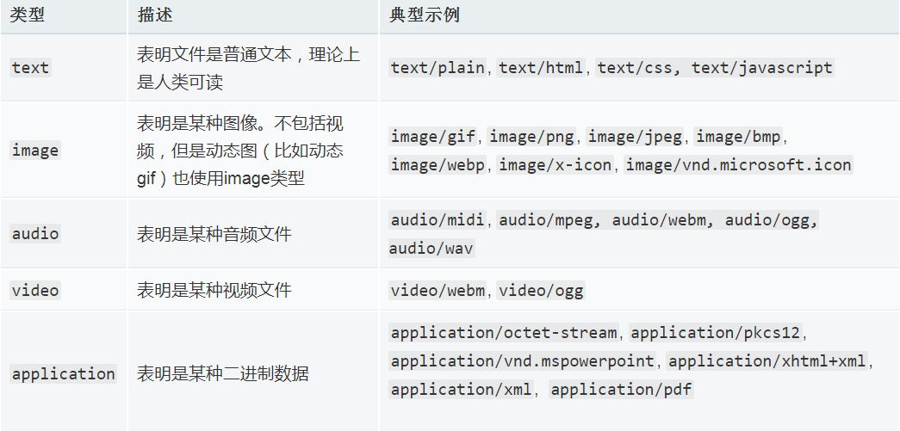

# 本项目为学习JSR-340规范

## 资源链接

中文翻译：http://www.iteye.com/news/27727-jinnianshilongnian

英文原版：https://jcp.org/en/jsr/detail?id=340

## Servlet

### 什么是Servlet

Servlet是基于Java技术的web组件，容器托管的，用于生成动态内容。

### 什么是Servlet容器

Servlet容器就是运行Servlet的服务器，是web server或application server的一部分，提供基于请求/响应发送模型的网络服务，解码基于MIME的请求，并格式化基于MIME的响应。

MIEI（媒体类型）：

```IMEI
text/plain
text/html
image/jpeg
image/png
audio/mpeg
audio/ogg
audio/*
video/mp4
application/*
application/json
application/javascript
application/ecmascript
application/octet-stream
```



Servlet容器会对Servlet的生命周期进行管理

IMEI  ref：

https://developer.mozilla.org/zh-CN/docs/Web/HTTP/Basics_of_HTTP/MIME_types

https://developer.mozilla.org/zh-CN/docs/Web/HTTP/Basics_of_HTTP/MIME_types/Common_types

## ServletContext（Servlet 上下文）

### Servlet接口

ServletContext接口定义了Servlet运行在Web应用的视图。

Servlet可以通过ServletContext对象记录事件

