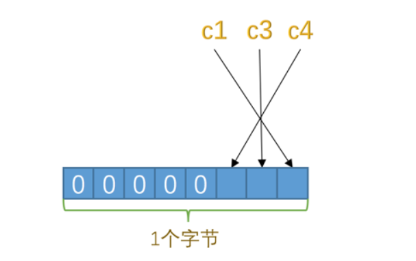
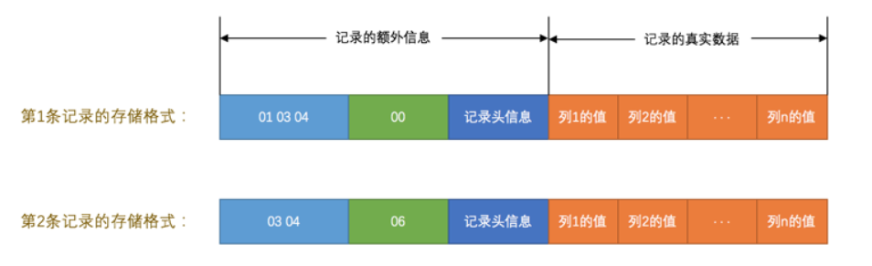
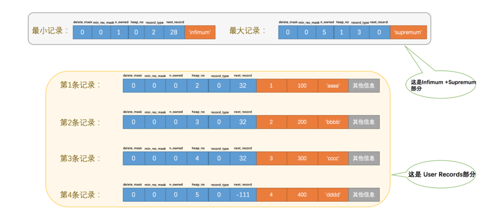
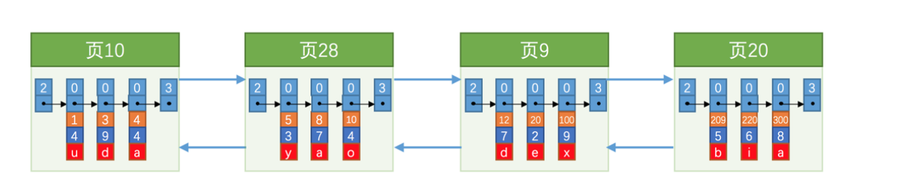
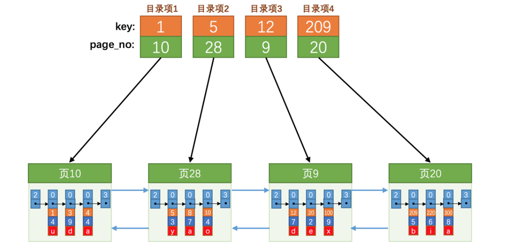

# MySQL

## 基础

mysql服务端与客户端是通过TCP/IP协议进行连接的

### 服务端处理请求过程


#### 连接管理

1. 服务端主要采用TCP/IP协议进行通信。

2. 服务端维护一个线程池去处理客户端的请求。

#### 解析与优化

1. 查询缓存
   * mysql会对同样的sql（严格区分大小写，空格，应该是通过语句的MD5值去查询是否有缓存）直接返回结果，而不去库里面真正的查询
   * 系统表，系统函数，用户自定义变量和函数不会缓存结果
   * 当库、表的结构变化（删除/修改字段），数据的变化（删除/修改），缓存都会失效
   * MySQL 5.7.20 开始不推荐查询缓存，并在8.0删除
2. 语法解析
   * mysql服务器会对sql语句进行词法解析、语法分析、语义分析
3. 查询优化
   * mysql会自动为我们的sql语句进行优化，外连接转内连接，表达式简化等
   * 可以通过`explain`对sql进行解释，查看执行计划

#### 存储引擎

真实的数据操作（存储、更新、删除）都是由存储引擎进行操作的。

存储引擎原名：表处理器

存储引擎分为很多种：

|  存储引擎   |                 描述                 |
| :---------: | :----------------------------------: |
|  `ARCHIVE`  | 用于数据存档（行被插入后不能再修改） |
| `BLACKHOLE` |    丢弃写操作，读操作会返回空内容    |
|    `CSV`    |  在存储数据时，以逗号分隔各个数据项  |
| `FEDERATED` |            用来访问远程表            |
|  `InnoDB`   |    具备外键支持功能的事务存储引擎    |
|  `MEMORY`   |             置于内存的表             |
|   `MERGE`   |   用来管理多个MyISAM表构成的表集合   |
|  `MyISAM`   |       主要的非事务处理存储引擎       |
|    `NDB`    |        MySQL集群专用存储引擎         |

### 字符集

mysql 支持很多种字符集

其实主要的就是 utf8与utf8mb4

| 字符集名称 | Maxlen |
| :--------: | :----: |
|  `ascii`   |  `1`   |
|  `latin1`  |  `1`   |
|  `gb2312`  |  `2`   |
|   `gbk`    |  `2`   |
|   `utf8`   |  `3`   |
| `utf8mb4`  |  `4`   |

`utf8`字符集表示一个字符需要使用1～4个字节。

- `utf8mb3`：阉割过的`utf8`字符集，只使用1～3个字节表示字符。

- `utf8mb4`：正宗的`utf8`字符集，使用1～4个字节表示字符。

### 存储引擎

#### innodb

##### innodb页

存储引擎其实就是一个文件管理系统，需要文件进行相关I/O操作，但是如果每一条都交互一次，效率较低，因此需要一次性读取较多内容，


innodb页将数据分为若干个页，也页作为磁盘和内存之间的基本交互单位，innodb中页一般的大小为16K。

也就是说，一次最少读取16K的内容到内存中，一次最少把16K的内容写入到磁盘中。


### 行格式

记录在磁盘上的存放方式也被称为`行格式`或者`记录格式`，也就是数据在磁盘上的存储方式。

innodb中共有4种

* `Compact`
* `Redundant`
* `Dynamic`
* `Compressed`

#### COMPACT行格式


一条完整的记录其实可以被分为`记录的额外信息`和`记录的真实数据`两大部分

* 额外信息：这部分信息是<span style="color:red">服务器为了描述这条记录而不得不额外添加的一些信息</span>，这些额外信息分为3类，分别是`变长字段长度列表`、`NULL值列表`和`记录头信息`
  * 变长字段长度列表：有些字段是变长的，如`VARCHAR(M)`、`VARBINARY(M)`、各种`TEXT`类型。所谓变长，指的是：存储的多少字节是不固定的（应该指的是 没有对齐填充，比如int类型，int(1) 、int(11)都是占用4字节，varchar(255)则是说明最多可以255个字符，但是真正占用多少字节，不固定，不进行填充）因此需要记录变长字段真正占用了多少字节， 因此 变长占用了2部分的存储空间：1、额外信息中的长度信息，2、真实数据的内容
  * NULL值列表：
  * 头信息
* 真实数据


如果有字段：

| 列名 | 可否为NULL |
| :--: | :--------: |
| `c1` |   `NULL`   |
| `c2` | `NOT NULL` |
| `c3` |   `NULL`   |
| `c4` |   `NULL`   |


##### 变长字段长度列表

在`Compact`行格式中，<span style="color:red">把所有变长字段的真实数据占用的字节长度都存放在记录的开头部位，从而形成一个变长字段长度列表，各变长字段数据占用的字节数按照列的顺序逆序存放</span>，我们再次强调一遍，是<span style="color:red">逆序</span>存放！

如表 ascii字符集 的第一行记录：

| 列名 | 存储内容（varchar） | 内容长度（十进制表示） | 内容长度（十六进制表示） |
| :--: | :-----------------: | :--------------------: | :----------------------: |
| `c1` |      `'aaaa'`       |          `4`           |          `0x04`          |
| `c2` |       `'bbb'`       |          `3`           |          `0x03`          |
| `c3` |       `NULL`        |                        |                          |
| `c4` |        `'d'`        |          `1`           |          `0x01`          |

又因为这些长度值需要按照列的<span style="color:red">逆序</span>存放，所以最后`变长字段长度列表`的字节串用十六进制表示的效果就是（各个字节之间实际上没有空格，用空格隔开只是方便理解）：

```
01 03 04 
```

把这个字节串组成的`变长字段长度列表`填入上边的示意图中的效果就是：


关于额外信息 中的  变长字字段长度  占用字节数（1字节或者2字节）有 以下规定：

假设：

* `W`：单个字符占用字节数（ascii 为1 iso-8859-1为2 utf8为1-3  utf8mb4为1-4）
* `M`：变长字段最多允许M个字符（varchar（M），M为字符数，汉字可以存M个，英文字母也可以存M个）
* `L`：实际占用字节数

有：

* M*W <= 255 采用 1个字节表示长度
* M*W  >   255  分为
  1. L <= 127 则用1个字节来表示真正字符串占用的字节数。
  2. L   >  127 则用2个字节来表示真正字符串占用的字节数

> InnoDB在读记录的变长字段长度列表时先查看表结构，如果某个变长字段允许存储的最大字节数大于255时，该怎么区分它正在读的某个字节是一个单独的字段长度还是半个字段长度呢？设计InnoDB的大叔使用该字节的第一个二进制位作为标志位：如果该字节的第一个位为0，那该字节就是一个单独的字段长度（使用一个字节表示不大于127的二进制的第一个位都为0），如果该字节的第一个位为1，那该字节就是半个字段长度。
>
> 对于一些占用字节数非常多的字段，比方说某个字段长度大于了16KB，那么如果该记录在单个页面中无法存储时，InnoDB会把一部分数据存放到所谓的溢出页中（我们后边会唠叨），在变长字段长度列表处只存储留在本页面中的长度，所以使用两个字节也可以存放下来。

第二行记录：

| 列名 | 存储内容（varchar） | 内容长度（十进制表示） | 内容长度（十六进制表示） |
| :--: | :-----------------: | :--------------------: | :----------------------: |
| `c1` |      `'eeee'`       |          `4`           |          `0x04`          |
| `c2` |       `'fff'`       |          `3`           |          `0x03`          |
| `c3` |       `NULL`        |                        |                          |
| `c4` |       `NULL`        |                        |                          |

​	

>并不是所有记录都有这个 变长字段长度列表 部分，比方说表中所有的列都不是变长的数据类型的话，这一部分就不需要有。


##### NULL列表

NULL值列表主要保存了哪些字段是NULL值，哪些不是NULL值，在真实数据部分中不保留NULL值列

1. NULL值列表主要是一个bit数组，将每个允许存储`NULL`的列对应一个二进制位，二进制位按照列的顺序<span style="color:red">逆序</span>排列，二进制位表示的意义如下：
   * 二进制位的值为`1`时，代表该列的值为`NULL`。
   * 二进制位的值为`0`时，代表该列的值不为`NULL`。
2. 如果列被设置为`NOT NULL` 则不需要统计进来，如果所有字段都是`NOT NULL`，那么NULL值列表也不存在


那么它的NULL值列表如下（由于只有3个字段可为NULL，NULL值列最少占用1字节（8位），高位自动填充0，当有9列允许null时，则占用2个字节），这这里列与bit位也是相反顺序：




在上面的例子中，第一行数据，c3列为null（博主的图错误），暂时认为全都有值，不为null


所以第一条记录的`NULL值列表`用十六进制表示就是：`0x00`。


对于第二条记录来说，`c1`、`c3`、`c4`这3个列中`c3`和`c4`的值都为`NULL`，所以这3个列对应的二进制位的情况就是：


所以第二条记录的`NULL值列表`用十六进制表示就是：`0x06`。



##### 记录头信息

记录头信息 是由固定的`5`个字节组成。`5`个字节也就是`40`个二进制位，不同的位代表不同的意思


这些二进制位代表的详细信息如下表：

|      名称      | 大小（单位：bit） |                             描述                             |
| :------------: | :---------------: | :----------------------------------------------------------: |
|   `预留位1`    |        `1`        |                           没有使用                           |
|   `预留位2`    |        `1`        |                           没有使用                           |
| `delete_mask`  |        `1`        |                     标记该记录是否被删除                     |
| `min_rec_mask` |        `1`        |        B+树的每层非叶子节点中的最小记录都会添加该标记        |
|   `n_owned`    |        `4`        |                   表示当前记录拥有的记录数                   |
|   `heap_no`    |       `13`        |                表示当前记录在记录堆的位置信息                |
| `record_type`  |        `3`        | 表示当前记录的类型，`0`表示普通记录，`1`表示B+树非叶子节点记录，`2`表示最小记录，`3`表示最大记录 |
| `next_record`  |       `16`        |                   表示下一条记录的相对位置                   |

第一条的头信息：


##### 真实数据

对于`record_format_demo`表来说，`记录的真实数据`除了`c1`、`c2`、`c3`、`c4`这几个我们自己定义的列的数据以外，`MySQL`会为每个记录默认的添加一些列（也称为`隐藏列`），具体的列如下：

|       列名       |   真实名称    | 是否必须 | 占用空间 |          描述          |
| :--------------: | :-----------: | :------: | :------: | :--------------------: |
|     `row_id`     |  `DB_ROW_ID`  |    否    | `6`字节  | 行ID，唯一标识一条记录 |
| `transaction_id` |  `DB_TRX_ID`  |    是    | `6`字节  |         事务ID         |
|  `roll_pointer`  | `DB_ROLL_PTR` |    是    | `7`字节  |        回滚指针        |

```!
实际上这几个列的真正名称其实是：DB_ROW_ID、DB_TRX_ID、DB_ROLL_PTR，我们为了美观才写成了row_id、transaction_id和roll_pointer。
```

这里需要提一下`InnoDB`表对主键的生成策略：优先使用用户自定义主键作为主键，如果用户没有定义主键，则选取一个`Unique`键作为主键，如果表中连`Unique`键都没有定义的话，则`InnoDB`会为表默认添加一个名为`row_id`的隐藏列作为主键。所以我们从上表中可以看出：<span style="color:red">InnoDB存储引擎会为每条记录都添加 ***transaction_id*** 和 ***roll_pointer*** 这两个列，但是 ***row_id*** 是可选的（在没有自定义主键以及Unique键的情况下才会添加该列）</span>。这些隐藏列的值不用我们操心，`InnoDB`存储引擎会自己帮我们生成的。


看这个图的时候我们需要注意几点：

1. 表使用的是`ascii`字符集，所以`0x61616161`就表示字符串`'aaaa'`，`0x626262`就表示字符串`'bbb'`，以此类推。
2. 注意第1条记录中`c3`列的值，它是`CHAR(10)`类型的，它实际存储的字符串是：`'cc'`，而`ascii`字符集中的字节表示是`'0x6363'`，虽然表示这个字符串只占用了2个字节，但整个`c3`列仍然占用了10个字节的空间，除真实数据以外的8个字节的统统都用<span style="color:red">空格字符</span>填充，空格字符在`ascii`字符集的表示就是`0x20`。
3. 注意第2条记录中`c3`和`c4`列的值都为`NULL`，它们被存储在了前边的`NULL值列表`处，在记录的真实数据处就不再冗余存储，从而节省存储空间。

关于 CHAR（M）

>当使用的是定长的字符集时，如ascii的时候，变长字段只有是varchar类型，会存在真实的占用多少的问题
>
>当使用的是变长的字符集，如UTF8，char也会变成变长类型


CHAR（M）中的 M在定长字符集中是指定占用M个字节，而在变长字符集中是至少M个字节。

VARCHAR（M）中的M则是指定多少个字符，一个字符占用多少字节，则是有字符集设定的。


#### Redundant行格式


该格式 是5.0之前的格式。

##### 字段长度偏移列表

注意`Compact`行格式的开头是`变长字段长度列表`，而`Redundant`行格式的开头是`字段长度偏移列表`，与`变长字段长度列表`有两处不同：

- 没有了<span style="color:red">变长</span>两个字，意味着`Redundant`行格式会把该条记录中<span style="color:red">所有列</span>（包括`隐藏列`）的长度信息都按照<span style="color:red">逆序</span>存储到`字段长度偏移列表`。

- 多了个<span style="color:red">偏移</span>两个字，这意味着计算列值长度的方式不像`Compact`行格式那么直观，它是采用两个相邻数值的<span style="color:red">差值</span>来计算各个列值的长度。


##### 记录头信息

`Redundant`行格式的记录头信息占用`6`字节，`48`个二进制位，这些二进制位代表的意思如下：

|       名称        | 大小（单位：bit） |                             描述                             |
| :---------------: | :---------------: | :----------------------------------------------------------: |
|     `预留位1`     |        `1`        |                           没有使用                           |
|     `预留位2`     |        `1`        |                           没有使用                           |
|   `delete_mask`   |        `1`        |                     标记该记录是否被删除                     |
|  `min_rec_mask`   |        `1`        |        B+树的每层非叶子节点中的最小记录都会添加该标记        |
|     `n_owned`     |        `4`        |                   表示当前记录拥有的记录数                   |
|     `heap_no`     |       `13`        |                表示当前记录在页面堆的位置信息                |
|     `n_field`     |       `10`        |                      表示记录中列的数量                      |
| `1byte_offs_flag` |        `1`        | 标记字段长度偏移列表中每个列对应的偏移量是使用1字节还是2字节表示的 |
|   `next_record`   |       `16`        |                   表示下一条记录的相对位置                   |

与`Compact`行格式的记录头信息对比来看，有两处不同：

- `Redundant`行格式多了`n_field`和`1byte_offs_flag`这两个属性。

- `Redundant`行格式没有`record_type`这个属性。


`1byte_offs_flag` 该值代表  字段长度偏移量中每个值是由 1个字节 还是两个字节组成的，主要符合以下：

* 当记录的真实数据（总共）占用的字节数不大于127（十六进制`0x7F`，二进制`01111111`）时，每个列对应的偏移量占用1个字节。
* 当记录的真实数据（总共）占用的字节数大于127，但不大于32767（十六进制`0x7FFF`，二进制`0111111111111111`）时，每个列对应的偏移量占用2个字节。

* 当记录的真实数据（总共）占用的字节数大于32767，存放到了溢出页中，在本页中只保留前`768`个字节和20个字节的溢出页面地址（当然这20个字节中还记录了一些别的信息）。因为`字段长度偏移列表`处只需要记录每个列在本页面中的偏移就好了，所以每个列使用2个字节来存储偏移量就够了。

由于该行模式下没有NULL值列表，只能使用`字段长度偏移列表`的最高位，表示该字段是否为NULL值

* 高位是1，代表该字段是NULL值
* 高位是0，则不为NULL


因为 `字段长度偏移列表`要么是1字节，要么是2字节，因此最高位被占用，

因此出现：

* 小于127字节可以使用1字节，（1字节范围0-255）
* 大于127就要使用2字节，且大于32767时候，就需要溢出页了（2字节范围是0-65535）

char(M):在此行格式下char(M)中字段偏移列表中直接就是表示一个字符最多的占用字节数*M


##### 行溢出数据

VARCHAR（M）中的，做多占用65535个字节。

为了存储一个`VARCHAR(M)`类型的列，其实需要占用3部分存储空间，这三部分合起来占用的字节数不能超过65535：

- 真实数据   2字节
- 真实数据占用字节的长度
- `NULL`值标识，如果该列有`NOT NULL`属性则可以没有这部分存储空间  1字节

如果该`VARCHAR`类型的列没有`NOT NULL`属性，那最多只能存储`65532`个字节的数据，因为真实数据的长度可能占用2个字节，`NULL`值标识需要占用1个字节：

如果`VARCHAR`类型的列有`NOT NULL`属性，那最多只能存储`65533`个字节的数据，因为真实数据的长度可能占用2个字节，不需要`NULL`值标识：

16K=16384字节，VARCAHR(65533) 最多需要 65535字节空间，因此会溢出

在`Compact`和`Reduntant`行格式中，对于占用存储空间非常大的列，在`记录的真实数据`处只会存储该列的一部分数据把剩余的数据分散存储在几个其他的页中，然后`记录的真实数据`处用20个字节存储指向这些页的地址（当然这20个字节中还包括这些分散在其他页面中的数据的占用的字节数），从而可以找到剩余数据所在的页，如图所示：


从图中可以看出来，对于`Compact`和`Reduntant`行格式来说，如果某一列中的数据非常多的话，在本记录的真实数据处只会存储该列的前`768`个字节的数据和一个指向其他页的地址，然后把剩下的数据存放到其他页中，这个过程也叫做`行溢出`，存储超出`768`字节的那些页面也被称为`溢出页`。画一个简图就是这样：


在MySQL设定中，当varchar列长度达到768byte后，会将该列的前768byte当作当作prefix存放在行中

如果我们想一个行中存储了很大的数据时，可能发生`行溢出`的现象

#### Dynamic和Compressed行格式

下边要介绍另外两个行格式，`Dynamic`和`Compressed`行格式，我现在使用的`MySQL`版本是`5.7`，它的默认行格式就是`Dynamic`，这俩行格式和`Compact`行格式挺像，只不过在处理`行溢出`数据时有点儿分歧，它们不会在记录的真实数据处存储字段真实数据的前`768`个字节，而是把所有的字节都存储到其他页面中，只在记录的真实数据处存储其他页面的地址，就像这样：


`Compressed`行格式和`Dynamic`不同的一点是，`Compressed`行格式会采用压缩算法对页面进行压缩，以节省空间。


### InnoDB页结构

页是InnoDB管理存储空间的基本单位，一般一个页为16K =  16384 个字节

页的类型有不同的几种：比如存放表空间头部信息的页，存放`Insert Buffer`信息的页，存放`INODE`信息的页，存放`undo`日志信息的页等等等等

#### 页的数据结构


一个`InnoDB`数据页的存储空间大致被划分成了`7`个部分

|         名称         |       中文名       |  占用空间大小   |         简单描述         |
| :------------------: | :----------------: | :-------------: | :----------------------: |
|    `File Header`     |      文件头部      |    `38`字节     |     页的一些通用信息     |
|    `Page Header`     |      页面头部      |    `56`字节     |   数据页专有的一些信息   |
| `Infimum + Supremum` | 最小记录和最大记录 |    `26`字节     |     两个虚拟的行记录     |
|    `User Records`    |      用户记录      |     不确定      |   实际存储的行记录内容   |
|     `Free Space`     |      空闲空间      |     不确定      |    页中尚未使用的空间    |
|   `Page Directory`   |      页面目录      |     不确定      | 页中的某些记录的相对位置 |
|    `File Trailer`    |      文件尾部      |     `8`字节     |      校验页是否完整      |
|    `ALL`（总计）     |                    | 16K=`16384`字节 |                          |


记录在页中的存储

1. 一般一个新的页是没有`User Records`，当该页插入第一条记录的时候，系统首先像`Free Space`申请一个空间，用于保存记录，然后该空间就被划分到`User Records`部分
2. 当该页的`Free Space`部分全部划分为`User Records`区时，就意味着该页使用完毕
3. 如果还有新的记录插入，则需要重新申请一个新的页，进行分配


#### 再谈记录头

```mysql
mysql> CREATE TABLE page_demo(
    ->     c1 INT,
    ->     c2 INT,
    ->     c3 VARCHAR(10000),
    ->     PRIMARY KEY (c1)
    -> ) CHARSET=ascii ROW_FORMAT=Compact;
```

这个新创建的`page_demo`表有3个列，其中`c1`和`c2`列是用来存储整数的，`c3`列是用来存储字符串的。需要注意的是，<span style="color:red">我们把 ***c1*** 列指定为主键，所以在具体的行格式中InnoDB就没必要为我们去创建那个所谓的 ***row_id*** 隐藏列了</span>。而且我们为这个表指定了`ascii`字符集以及`Compact`的行格式。所以这个表中记录的行格式示意图就是这样的：


```
mysql> INSERT INTO page_demo VALUES(1, 100, 'aaaa'), (2, 200, 'bbbb'), (3, 300, 'cccc'), (4, 400, 'dddd');
Query OK, 4 rows affected (0.00 sec)
Records: 4  Duplicates: 0  Warnings: 0
```


该图已经转化为 10进制，正常存储是2进制

* `delete_mask`

这个属性标记着当前记录是否被删除，占用1个二进制位，值为`0`的时候代表记录并没有被删除，为`1`的时候代表记录被删除掉了。

啥？被删除的记录还在`页`中么？是的，摆在台面上的和背地里做的可能大相径庭，你以为它删除了，可它还在真实的磁盘上[摊手]（忽然想起冠希～）。这些被删除的记录之所以不立即从磁盘上移除，是因为移除它们之后把其他的记录在磁盘上重新排列需要性能消耗，所以只是打一个删除标记而已，所有被删除掉的记录都会组成一个所谓的`垃圾链表`，在这个链表中的记录占用的空间称之为所谓的`可重用空间`，之后如果有新记录插入到表中的话，可能把这些被删除的记录占用的存储空间覆盖掉。

* `min_rec_mask`

B+树的每层非叶子节点中的最小记录都会添加该标记

* `n_owned`

重点

* `heap_no`

这个属性表示当前记录在本`页`中的位置

由上图可知，我们插入的是  2 3 4 5 缺少 0 1

Mysql在页中会 自动给每个页里边儿加了两个记录，由于这两个记录并不是我们自己插入的，所以有时候也称为`伪记录`或者`虚拟记录`。这两个伪记录一个代表`最小记录`，一个代表`最大记录`。


但是不管我们向`页`中插入了多少自己的记录，设计`InnoDB`的大叔们都规定他们定义的两条伪记录分别为最小记录与最大记录。这两条记录的构造十分简单，都是由5字节大小的`记录头信息`和8字节大小的一个固定的部分组成的，如图所示


这两条`虚拟记录`不会被放在`User Records`中，而是会被放到`页`结构中的`Infimum + Supremum`部分，总共占用26字节



可以看出 最大最小记录的`heap_on`分别是 0  1


* `record_type`

这个属性表示当前记录的类型，一共有4种类型的记录，`0`表示普通记录，`1`表示B+树非叶节点记录，`2`表示最小记录，`3`表示最大记录。

从图中我们也可以看出来，我们自己插入的记录就是普通记录，它们的`record_type`值都是`0`，而最小记录和最大记录的`record_type`值分别为`2`和`3`。

至于`record_type`为`1`的情况，索引的时候会重点强调

* `next_record`

表示<span style="color:red">从当前记录的真实数据到下一条记录的真实数据的地址偏移量</span>。 从该条真实数据开始到下条真实数据开始的偏移量（或者说是中间有多少字节被其他东西占用）。

比方说第一条记录的`next_record`值为`32`，意味着从第一条记录的真实数据的地址处向后找`32`个字节便是下一条记录的真实数据。

<span style="color:red">`下一条记录`指得并不是按照我们插入顺序的下一条记录，而是按照主键值由小到大的顺序的下一条记录</span>。而且规定<span style="color:red"> ***Infimum记录（也就是最小记录）*** 的下一条记录就是本页中主键值最小的用户记录，而本页中主键值最大的用户记录的下一条记录就是 ***Supremum记录（也就是最大记录）***  </span>


`最大记录`的`next_record`的值为`0`，这也就是说最大记录是没有`下一条记录`了，它是这个单链表中的最后一个节点。

如果从中删除掉一条记录，这个链表也是会跟着变化的，比如我们把第2条记录删掉：


从图中可以看出来，删除第2条记录前后主要发生了这些变化：

- 第2条记录并没有从存储空间中移除，而是把该条记录的`delete_mask`值设置为`1`。
- 第2条记录的`next_record`值变为了0，意味着该记录没有下一条记录了。
- 第1条记录的`next_record`指向了第3条记录。
- 还有一点你可能忽略了，就是`最大记录`的`n_owned`值从`5`变成了`4`，关于这一点的变化我们稍后会详细说明的。

所以，<span style="color:red">不论我们怎么对页中的记录做增删改操作，InnoDB始终会维护一条记录的单链表，链表中的各个节点是按照主键值由小到大的顺序连接起来的</span>。

>你会不会觉得next_record这个指针有点儿怪，为啥要指向记录头信息和真实数据之间的位置呢？为啥不干脆指向整条记录的开头位置，也就是记录的额外信息开头的位置呢？
>
>因为这个位置刚刚好，向左读取就是记录头信息，向右读取就是真实数据。我们前边还说过变长字段长度列表、NULL值列表中的信息都是逆序存放，这样可以使记录中位置靠前的字段和它们对应的字段长度信息在内存中的距离更近，可能会提高高速缓存的命中率。当然如果你看不懂这句话的话就不要勉强了，果断跳过～


虽然主键为2的内容被删除了，但是在数据页中仍然存在，没有被真正的删除，只是标记了删除位，如果在插入一个id为2的内容：


当数据页中存在多条被删除掉的记录时，这些记录的next_record属性将会把这些被删除掉的记录组成一个垃圾链表，以备之后重用这部分存储空间。

#### Page Directory（页目录）

设计`InnoDB`的大叔们为我们的记录也制作了一个类似的目录：

1. 将所有正常的记录（包括最大和最小记录，不包括标记为已删除的记录）划分为几个组。
2. 每个组的<span style="color:red">最后</span>一条记录（也就是组内最大的那条记录）的头信息中的`n_owned`属性表示该记录拥有多少条记录，也就是该组内共有几条记录。
3. 将每个组的最后一条记录的地址偏移量单独提取出来按顺序存储到靠近`页`的尾部的地方，这个地方就是所谓的`Page Directory`，也就是`页目录`（此时应该返回头看看页面各个部分的图）。页面目录中的这些地址偏移量被称为`槽`（英文名：`Slot`），所以这个页面目录就是由`槽`组成的。

比方说现在的`page_demo`表中正常的记录共有6条，`InnoDB`会把它们分成两组，第一组中只有一个最小记录，第二组中是剩余的5条记录，看下边的示意图（真实的存储示意图）：


从这个图中我们需要注意这么几点：

- 现在`页目录`部分中有两个槽，也就意味着我们的记录被分成了两个组，`槽1`中的值是`112`，代表最大记录的地址偏移量（就是从页面的0字节开始数，数112个字节）；`槽0`中的值是`99`，代表最小记录的地址偏移量。

- 注意最小和最大记录的头信息中的`n_owned`属性

  - 最小记录的`n_owned`值为`1`，这就代表着以最小记录结尾的这个分组中只有`1`条记录，也就是最小记录本身。
  - 最大记录的`n_owned`值为`5`，这就代表着以最大记录结尾的这个分组中只有`5`条记录，包括最大记录本身还有我们自己插入的`4`条记录。

用线条代替槽中的数值：


在修改为最直观的：


自我总结：

其实在这里 Page Dirctory 里面的内容是两个偏移量（可以理解直观上的指针） 指向两条虚拟记录的，最大跟最小。


为什么最小记录的`n_owned`值为1，而最大记录的`n_owned`值为`5`呢？

每个分组中的记录条数是有规定的：<span style="color:red">对于最小记录所在的分组只能有 ***1*** 条记录，最大记录所在的分组拥有的记录条数只能在 ***1~8*** 条之间，剩下的分组中记录的条数范围只能在是 ***4~8*** 条之间</span>。

- 初始情况下一个数据页里只有最小记录和最大记录两条记录，它们分属于两个分组。
- 之后每插入一条记录，都会从`页目录`中找到主键值比本记录的主键值大并且差值最小的槽，然后把该槽对应的记录的`n_owned`值加1，表示本组内又添加了一条记录，直到该组中的记录数等于8个。
- 在一个组中的记录数等于8个后再插入一条记录时，会将组中的记录拆分成两个组，一个组中4条记录，另一个5条记录。这个过程会在`页目录`中新增一个`槽`来记录这个新增分组中最大的那条记录的偏移量。

添加到16条记录


1. 计算中间槽的位置：`(0+4)/2=2`，所以查看`槽2`对应记录的主键值为`8`，又因为`8 > 6`，所以设置`high=2`，`low`保持不变。

2. 重新计算中间槽的位置：`(0+2)/2=1`，所以查看`槽1`对应的主键值为`4`，又因为`4 < 6`，所以设置`low=1`，`high`保持不变。

3. 因为`high - low`的值为1，所以确定主键值为`6`的记录在`槽2`对应的组中。此刻我们需要找到`槽2`中主键值最小的那条记录，然后沿着单向链表遍历`槽2`中的记录。但是我们前边又说过，每个槽对应的记录都是该组中主键值最大的记录，这里`槽2`对应的记录是主键值为`8`的记录，怎么定位一个组中最小的记录呢？别忘了各个槽都是挨着的，我们可以很轻易的拿到`槽1`对应的记录（主键值为`4`），该条记录的下一条记录就是`槽2`中主键值最小的记录，该记录的主键值为`5`。所以我们可以从这条主键值为`5`的记录出发，遍历`槽2`中的各条记录，直到找到主键值为`6`的那条记录即可。由于一个组中包含的记录条数只能是1~8条，所以遍历一个组中的记录的代价是很小的。

所以在一个数据页中查找指定主键值的记录的过程分为两步：

1. <span style="color:red">通过二分法确定该记录所在的槽，并找到该槽中主键值最小的那条记录</span>。
2. <span style="color:red">通过记录的`next_record`属性遍历该槽所在的组中的各个记录</span>。


#### Page Header（页头部）

页中定义了一个叫`Page Header`的部分，它是`页`结构的第二部分，这个部分占用固定的`56`个字节，专门存储各种状态信息，具体各个字节都是干嘛的看下表：

|        名称         | 占用空间大小 |                             描述                             |
| :-----------------: | :----------: | :----------------------------------------------------------: |
| `PAGE_N_DIR_SLOTS`  |   `2`字节    |                      在页目录中的槽数量                      |
|   `PAGE_HEAP_TOP`   |   `2`字节    | 还未使用的空间最小地址，也就是说从该地址之后就是`Free Space` |
|    `PAGE_N_HEAP`    |   `2`字节    | 本页中的记录的数量（包括最小和最大记录以及标记为删除的记录） |
|     `PAGE_FREE`     |   `2`字节    | 第一个已经标记为删除的记录地址（各个已删除的记录通过`next_record`也会组成一个单链表，这个单链表中的记录可以被重新利用） |
|   `PAGE_GARBAGE`    |   `2`字节    |                    已删除记录占用的字节数                    |
| `PAGE_LAST_INSERT`  |   `2`字节    |                      最后插入记录的位置                      |
|  `PAGE_DIRECTION`   |   `2`字节    |                        记录插入的方向                        |
| `PAGE_N_DIRECTION`  |   `2`字节    |                  一个方向连续插入的记录数量                  |
|    `PAGE_N_RECS`    |   `2`字节    | 该页中记录的数量（不包括最小和最大记录以及被标记为删除的记录） |
|  `PAGE_MAX_TRX_ID`  |   `8`字节    |        修改当前页的最大事务ID，该值仅在二级索引中定义        |
|    `PAGE_LEVEL`     |   `2`字节    |                   当前页在B+树中所处的层级                   |
|   `PAGE_INDEX_ID`   |   `8`字节    |                索引ID，表示当前页属于哪个索引                |
| `PAGE_BTR_SEG_LEAF` |   `10`字节   |          B+树叶子段的头部信息，仅在B+树的Root页定义          |
| `PAGE_BTR_SEG_TOP`  |   `10`字节   |         B+树非叶子段的头部信息，仅在B+树的Root页定义         |

对照着这个表格，我们看几个目前比较重要的部分：

- `FIL_PAGE_SPACE_OR_CHKSUM`

  这个代表当前页面的校验和（checksum）。啥是个校验和？就是对于一个很长很长的字节串来说，我们会通过某种算法来计算一个比较短的值来代表这个很长的字节串，这个比较短的值就称为`校验和`。这样在比较两个很长的字节串之前先比较这两个长字节串的校验和，如果校验和都不一样两个长字节串肯定是不同的，所以省去了直接比较两个比较长的字节串的时间损耗。

- `FIL_PAGE_OFFSET`

  每一个`页`都有一个单独的页号，就跟你的身份证号码一样，`InnoDB`通过页号来可以唯一定位一个`页`。

* `FIL_PAGE_TYPE`

这个代表当前`页`的类型，我们前边说过，`InnoDB`为了不同的目的而把页分为不同的类型，我们上边介绍的其实都是存储记录的`数据页`，其实还有很多别的类型的页，具体如下表：

|         类型名称          | 十六进制 |               描述               |
| :-----------------------: | :------: | :------------------------------: |
| `FIL_PAGE_TYPE_ALLOCATED` |  0x0000  |        最新分配，还没使用        |
|    `FIL_PAGE_UNDO_LOG`    |  0x0002  |            Undo日志页            |
|     `FIL_PAGE_INODE`      |  0x0003  |            段信息节点            |
| `FIL_PAGE_IBUF_FREE_LIST` |  0x0004  |      Insert Buffer空闲列表       |
|  `FIL_PAGE_IBUF_BITMAP`   |  0x0005  |        Insert Buffer位图         |
|    `FIL_PAGE_TYPE_SYS`    |  0x0006  |              系统页              |
|  `FIL_PAGE_TYPE_TRX_SYS`  |  0x0007  |           事务系统数据           |
|  `FIL_PAGE_TYPE_FSP_HDR`  |  0x0008  |          表空间头部信息          |
|   `FIL_PAGE_TYPE_XDES`    |  0x0009  |            扩展描述页            |
|   `FIL_PAGE_TYPE_BLOB`    |  0x000A  |              BLOB页              |
|     `FIL_PAGE_INDEX`      |  0x45BF  | 索引页，也就是我们所说的`数据页` |

我们存放记录的数据页的类型其实是`FIL_PAGE_INDEX`，也就是所谓的`索引页`。

* `FIL_PAGE_PREV`和`FIL_PAGE_NEXT`

mysql是通过页进行管理数据的，本质也是 双向链表 当页面非常多的时候，不一定在连续的空间内，因此需要前后值指针。

> `InnoDB`都是以页为单位存放数据的，有时候我们存放某种类型的数据占用的空间非常大（比方说一张表中可以有成千上万条记录），`InnoDB`可能不可以一次性为这么多数据分配一个非常大的存储空间，如果分散到多个不连续的页中存储的话需要把这些页关联起来，`FIL_PAGE_PREV`和`FIL_PAGE_NEXT`就分别代表本页的上一个和下一个页的页号。这样通过建立一个双向链表把许许多多的页就都串联起来了，而无需这些页在物理上真正连着。需要注意的是，<span style="color:red">并不是所有类型的页都有上一个和下一个页的属性</span>，不过我们本集中唠叨的`数据页`（也就是类型为`FIL_PAGE_INDEX`的页）是有这两个属性的，所以所有的数据页其实是一个双链表，就像这样：


#### File Trailer

我们知道`InnoDB`存储引擎会把数据存储到磁盘上，但是磁盘速度太慢，需要以`页`为单位把数据加载到内存中处理，如果该页中的数据在内存中被修改了，那么在修改后的某个时间需要把数据<span style="color:red">同步</span>到磁盘中。但是在同步了一半的时候中断电了咋办，这不是莫名尴尬么？为了检测一个页是否完整（也就是在同步的时候有没有发生只同步一半的尴尬情况），设计`InnoDB`的大叔们在每个页的尾部都加了一个`File Trailer`部分，这个部分由`8`个字节组成，可以分成2个小部分：

- 前4个字节代表页的校验和

  这个部分是和`File Header`中的校验和相对应的。每当一个页面在内存中修改了，在同步之前就要把它的校验和算出来，因为`File Header`在页面的前边，所以校验和会被首先同步到磁盘，当完全写完时，校验和也会被写到页的尾部，如果完全同步成功，则页的首部和尾部的校验和应该是一致的。如果写了一半儿断电了，那么在`File Header`中的校验和就代表着已经修改过的页，而在`File Trialer`中的校验和代表着原先的页，二者不同则意味着同步中间出了错。

- 后4个字节代表页面被最后修改时对应的日志序列位置（LSN）

这个`File Trailer`与`File Header`类似，都是所有类型的页通用的。

### B+树索引

`InnoDB`数据页的7个组成部分，知道了各个数据页可以组成一个`双向链表`，而每个数据页中的记录会按照主键值从小到大的顺序组成一个`单向链表`，每个数据页都会为存储在它里边儿的记录生成一个`页目录`，在通过主键查找某条记录的时候可以在`页目录`中使用二分法快速定位到对应的槽，然后再遍历该槽对应分组中的记录即可快速找到指定的记录。


其中页a、页b、页c ... 页n 这些页可以不在物理结构上相连，只要通过双向链表相关联即可。

#### 在一个页中查找

- 以主键为搜索条件

  这个查找过程我们已经很熟悉了，可以在`页目录`中使用二分法快速定位到对应的槽，然后再遍历该槽对应分组中的记录即可快速找到指定的记录。

- 以其他列作为搜索条件

  对非主键列的查找的过程可就不这么幸运了，因为在数据页中并没有对非主键列建立所谓的`页目录`，所以我们无法通过二分法快速定位相应的`槽`。这种情况下只能从`最小记录`开始依次遍历单链表中的每条记录，然后对比每条记录是不是符合搜索条件。很显然，这种查找的效率是非常低的。

#### 在很多页中查找

大部分情况下我们表中存放的记录都是非常多的，需要好多的数据页来存储这些记录。在很多页中查找记录的话可以分为两个步骤：

1. 定位到记录所在的页。
2. 从所在的页内中查找相应的记录。

在没有索引的情况下，不论是根据主键列或者其他列的值进行查找，<span style="color:red">由于我们并不能快速的定位到记录所在的页，所以只能从第一个页沿着双向链表一直往下找，在每一个页中根据我们刚刚唠叨过的查找方式去查找指定的记录</span>。因为要遍历所有的数据页，所以这种方式显然是超级耗时的，如果一个表有一亿条记录，使用这种方式去查找记录那要等到猴年马月才能等到查找结果。所以祖国和人民都在期盼一种能高效完成搜索的方法，`索引`同志就要亮相登台了。


我们在根据某个搜索条件查找一些记录时为什么要遍历所有的数据页呢？

<span style="color:red">因为各个页中的记录并没有规律，我们并不知道我们的搜索条件匹配哪些页中的记录，所以 ***不得不*** 依次遍历所有的数据页</span>。所以如果我们想快速的定位到需要查找的记录在哪些数据页中该咋办？还记得我们为根据主键值快速定位一条记录在页中的位置而设立的页目录么？我们也可以想办法为快速定位记录所在的数据页而建立一个别的目录，建这个目录必须完成下边这些事儿：

- 下一个数据页中用户记录的主键值必须大于上一个页中用户记录的主键值。


<span style="color:red">新分配的数据页编号可能并不是连续的，也就是说我们使用的这些页在存储空间里可能并不挨着</span>

如上图，页28 中的第一条ID为4，比页10的最大ID5小，所以这就不符合<span style="color:red">下一个数据页中用户记录的主键值必须大于上一个页中用户记录的主键值</span>的要求，所以在插入主键值为`4`的记录的时候需要伴随着一次记录移动，也就是把主键值为`5`的记录移动到`页28`中，然后再把主键值为`4`的记录插入到`页10`中，这个过程的示意图如下：


这个过程表明了在对页中的记录进行增删改操作的过程中，我们必须通过一些诸如记录移动的操作来始终保证这个状态一直成立：<span style="color:red">下一个数据页中用户记录的主键值必须大于上一个页中用户记录的主键值</span>。这个过程我们也可以称为`页分裂`。

##### 给所有的页建立一个目录项。

由于<span style="color:red">数据页的编号可能并不是连续的</span>，所以在向`index_demo`表中插入许多条记录后，可能是这样的效果：



因为这些`16KB`的页在物理存储上可能并不挨着，所以如果想从这么多页中根据主键值快速定位某些记录所在的页，我们需要给它们做个目录，<span style="color:red">每个页对应一个目录项</span>，每个目录项包括下边两个部分

- 页的用户记录中最小的主键值，我们用`key`来表示。
- 页号，我们用`page_no`表示。



我们只需要把几个目录项在物理存储器上连续存储，比如把他们放到一个数组里，就可以实现<span style="color:red">根据主键值</span>快速查找某条记录的功能了。

比方说我们想找主键值为`20`的记录，具体查找过程分两步：

1. 先从目录项中根据二分法快速确定出主键值为`20`的记录在`目录项3`中（因为 `12 < 20 < 209`），它对应的页是`页9`。
2. 再根据前边说的在页中查找记录的方式去`页9`中定位具体的记录。

#### InnoDB中的索引方案

他们<span style="color:red">复用了之前存储用户记录的数据页来存储目录项，为了和用户记录做一下区分，我们把这些用来表示目录项的记录称为`目录项记录`</span>。那`InnoDB`怎么区分一条记录是普通的`用户记录`还是`目录项记录`呢？别忘了记录头信息里的`record_type`属性，它的各个取值代表的意思如下：

- `0`：普通的用户记录
- `1`：目录项记录
- `2`：最小记录
- `3`：最大记录


### 待添加


### EXPLAIN

