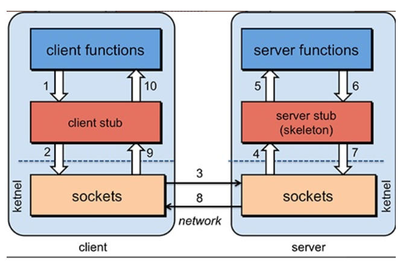
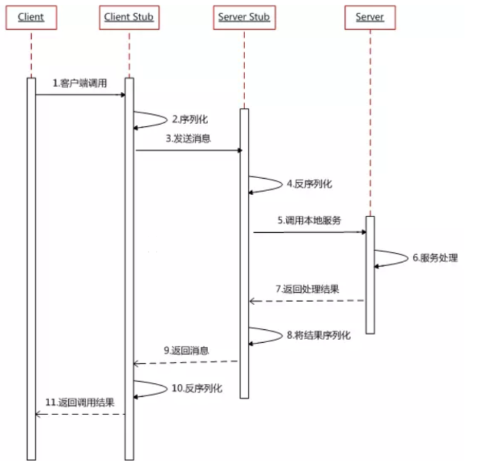

# RPC

## RPC概念

RPC（Remote Procedure Call）--远程过程调用

一种通过网络从远程计算机程序上请求服务，而不需要了解底层网络技术的协议。（主要屏蔽了网络调用细节，就想调用本地方法一样简便，）

是一种分布式框架

并且提供了“服务自动注册与发现”、"智能负载均衡"、“可视化的服务治理和运维”、“运行期流量调度”等等功

## RPC原理

基本步骤：

1.  服务消费方（client）调用以本地调用方式调用服务；
2.  client stub接收到调用后负责将方法、参数等组装成能够进行网络传输的消息体；
3.  client stub找到服务地址，并将消息发送到服务端；
4.  server stub收到消息后进行解码；
5.  server stub根据解码结果调用本地的服务；
6.  本地服务执行并将结果返回给server stub；
7.  server stub将返回结果打包成消息并发送至消费方；
8.  client stub接收到消息，并进行解码；
9.  服务消费方得到最终结果。

RPC框架就封装了2-8步骤。

stub = 占位代码，桩代码给出的实现是临时性的/待编辑的。

## 常见的RPC

* **RMI（JDK自带）：** JDK自带的RPC，有很多局限性，不推荐使用。
* **Dubbo:** Dubbo是 阿里巴巴公司开源的一个高性能优秀的服务框架，使得应用可通过高性能的 RPC 实现服务的输出和输入功能，可以和 Spring框架无缝集成。目前 Dubbo 已经成为 Spring Cloud Alibaba 中的官方组件。
* **gRPC** ：gRPC是可以在任何环境中运行的现代开源高性能RPC框架。它可以通过可插拔的支持来有效地连接数据中心内和跨数据中心的服务，以实现负载平衡，跟踪，运行状况检查和身份验证。它也适用于分布式计算的最后一英里，以将设备，移动应用程序和浏览器连接到后端服务。
* **Hessian：** Hessian是一个轻量级的remotingonhttp工具，使用简单的方法提供了RMI的功能。 相比WebService，Hessian更简单、快捷。采用的是二进制RPC协议，因为采用的是二进制协议，所以它很适合于发送二进制数据。
* **Thrift：** Apache Thrift是Facebook开源的跨语言的RPC通信框架，目前已经捐献给Apache基金会管理，由于其跨语言特性和出色的性能，在很多互联网公司得到应用，有能力的公司甚至会基于thrift研发一套分布式服务框架，增加诸如服务注册、服务发现等功能。

## RPC与HTTP

RPC是一种涉及，解决了不同服务之间的调用为题，它一般会包含有 **传输协议** 和 **序列化协议** 这两个。

RPC是一种API，HTTP是一种传输协议，RPC可以用HTTP来实现，当然，RPC也可用Socket来实现

微服务调用为啥用RPC框架，http不更简单吗？ - 支付技术那些事的文章 - 知乎 https://zhuanlan.zhihu.com/p/61364466

既然有 HTTP 请求，为什么还要用 RPC 调用？ - 易哥的回答 - 知乎 https://www.zhihu.com/question/41609070/answer/1030913797

