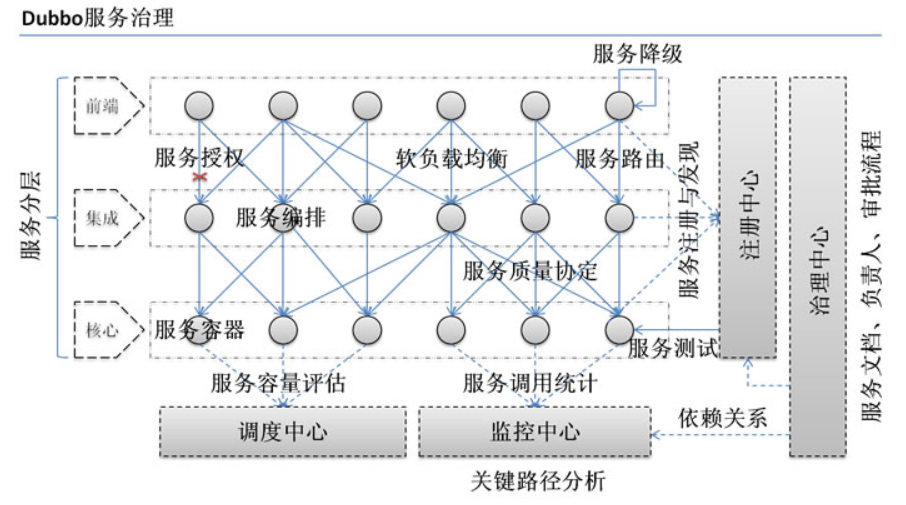
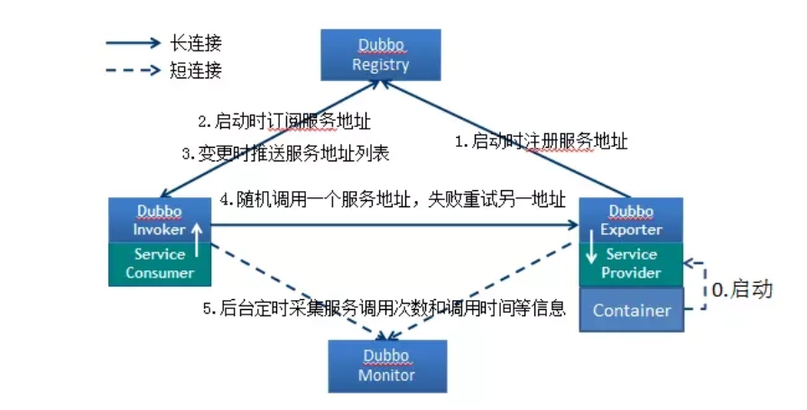
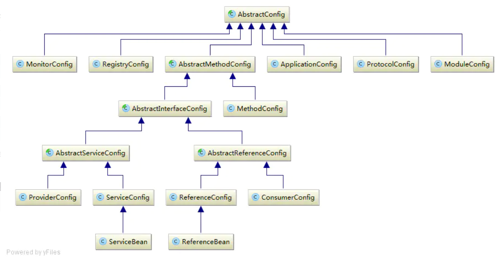
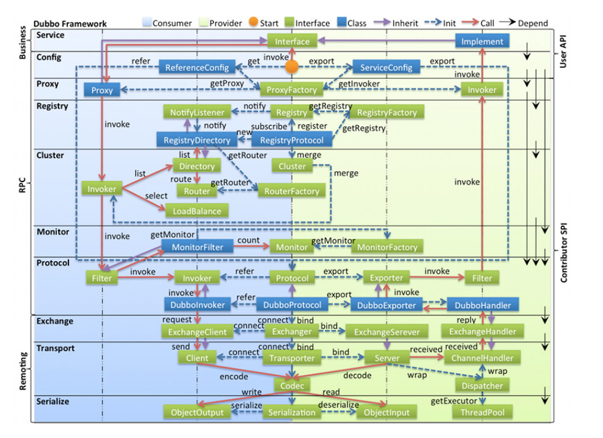
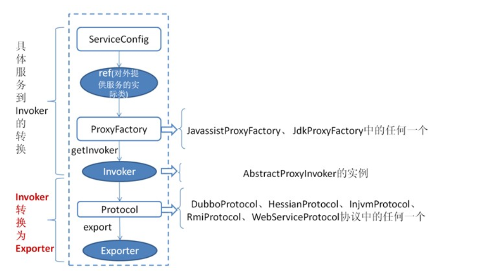
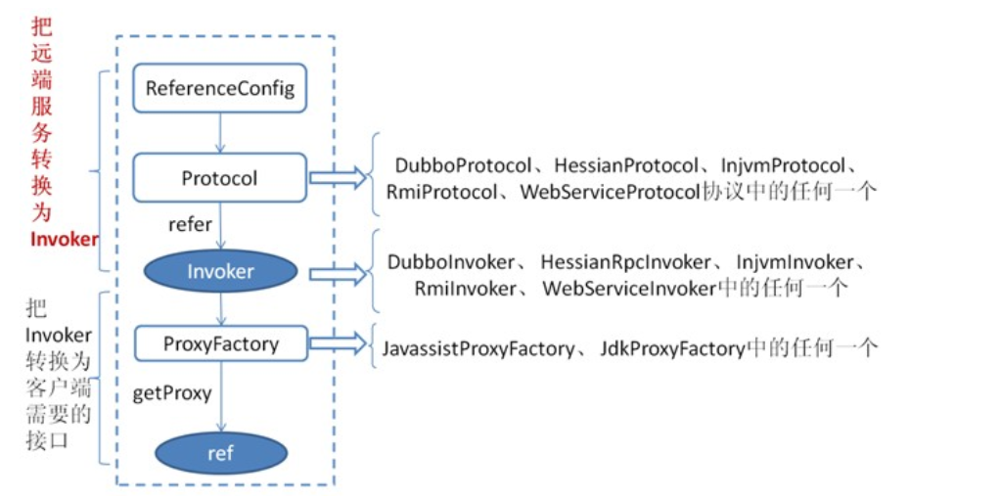

# 本项目为基本的 Redis demo

## 基本情况

* JDK：1.8.0_181
* Dubbo：2.7.8
* 注册中心版本：Dubbo版本<2.6版本，使用zkClient，Dubbo版本>=2.6使用curator

## Dubbo简介

### Dubbo需求

* 通过服务注册中心，动态地注册和发现服务，使服务的位置透明。
* 自动画出应用间的依赖关系图
* 统计服务现在每天的调用量，响应时间

### Dubbo架构

这些节点就代表一些Dubbo中的一些角色

| 节点        | 角色说明                               | 其他                  |
| ----------- | -------------------------------------- | --------------------- |
| `Provider`  | 暴露服务的服务提供方                   |                       |
| `Consumer`  | 调用远程服务的服务消费方               |                       |
| `Registry`  | 服务注册与发现的注册中心               | 一般使用zk            |
| `Monitor`   | 统计服务的调用次数和调用时间的监控中心 | 监控界面，dubbo有提供 |
| `Container` | 服务运行容器                           | 需要运行在服务器上    |

一般开发只需要关注`Provider`与`Consumer`

基本步骤：

1. 服务容器负责启动，加载，运行服务提供者。
2. 服务提供者在启动时，向注册中心注册自己提供的服务。
3. 服务消费者在启动时，向注册中心订阅自己所需的服务。
4. 注册中心返回服务提供者地址列表给消费者，如果有变更，注册中心将基于长连接推送变更数据给消费者。
5. 服务消费者，从提供者地址列表中，基于**软负载均衡**算法，选一台提供者进行调用，如果调用失败，再选另一台调用（**重试服务**）。
6. 服务消费者和提供者，在内存中累计调用次数和调用时间，定时每分钟发送一次统计数据到监控中心。

基于API的启动

各种config配置，感觉ProviderConfig与ServiceConfig部分配置会重合

基于API的配置主要有以下几个配置选项：

* ApplicationConfig：应用级配置，提供者/消费者都需要设置，在API模式下，2.7.8设置该config时，表示是一个过时方法，但是不设置又会抛出异常。
* RegistryConfig：注册中心配置，提供者/消费者都需要设置，如果选择直连，则需要这只为`N/A`，不设置该配置则抛出异常。
* ProtocolConfig：协议配置，提供者需要进行配置，可以设置具体的服务协议，一般使用`dubbo`协议，其他协议请参考
  * http://dubbo.apache.org/zh/docs/v2.7/user/references/protocol/
* ProviderConfig：提供者配置信息，该配置里面的信息基本与其他配置重合
* ServiceConfig：服务配置信息，设置ref，interface，export（对外服务）
* ConsumerConfig：消费者配置信息，该配置里面的信息基本与其他配置重合
* ReferenceConfig：引用配置，设置interface，get（获取本地代理对象）

## 为什么使用Dubbo

1. **负载均衡**——同一个服务部署在不同的机器时该调用那一台机器上的服务。
2. **服务调用链路生成**——随着系统的发展，服务越来越多，服务间依赖关系变得错踪复杂，甚至分不清哪个应用要在哪个应用之前启动，架构师都不能完整的描述应用的架构关系。Dubbo 可以为我们解决服务之间互相是如何调用的。
3. **服务访问压力以及时长统计、资源调度和治理**——基于访问压力实时管理集群容量，提高集群利用率。
4. **服务降级**——某个服务挂掉之后调用备用服务。

## Dubbo分层

- 第一层：**service层**，接口层，给服务提供者和消费者来实现的
- 第二层：**config层**，配置层，主要是对dubbo进行各种配置的
- 第三层：**proxy层**，服务接口透明代理，生成服务的客户端 Stub 和服务器端 Skeleton
- 第四层：**registry层**，服务注册层，负责服务的注册与发现
- 第五层：**cluster层**，集群层，封装多个服务提供者的路由以及负载均衡，将多个实例组合成一个服务
- 第六层：**monitor层**，监控层，对rpc接口的调用次数和调用时间进行监控
- 第七层：**protocol层**，远程调用层，封装rpc调用
- 第八层：**exchange层**，信息交换层，封装请求响应模式，同步转异步
- 第九层：**transport层**，网络传输层，抽象mina和netty为统一接口
- 第十层：**serialize层**，数据序列化层，网络传输需要

## Dubbo中负载均衡

### Random LoadBalance(默认，基于权重的随机负载均衡机制)

### RoundRobin LoadBalance(不推荐，基于权重的轮询负载均衡机制)

### LeastActive LoadBalance(最少活跃调用)

### ConsistentHash LoadBalance(一致性 Hash)

## Dubbo服务步骤

1. 服务提供方启动，连接注册中心，并将自己的信息注册到注册中心中，且对外提供服务。
2. 服务调用方启动，连接注册中心，寻找需要的提供方信息，根据类完全限定名，且订阅服务
3. 服务调用方生成代理对象（封装了序列化，远程调用），根据负载均衡，选择一台服务器进行调用，同时记录接口的调用次数和时间信息，每隔一段时间向Monitor进行同步
4. 通过代理对象，服务调用方可以直接调用相关方法
5. 服务提供方接收到远程调用，对数据进行反序列化，然后调用真实对象，再将结果序列化返回调用方

### 代理对象

代理对象中可以插入很多其他逻辑，如：统计、序列化、反序列化、容错、降级、重试等。

任何事情都可以通过加一层来解决

### 服务暴露过程

1. 容器启动，创建一个ServiceConfig，然后获取到对外服务的实际类Ref（我们的业务代码），然后通过ProxyFactory类的getInvoker方法生成一个服务代理类
2. DubboProtocol类拿到服务代理类，再通过一层包装，将Invoker转换成exporter，然后启动服务，监听端口
3. Register类将映射关系，地址信息等注册到配置中心

### 服务消费过程

1. 容器启动，通过配置信息到注册中心订阅服务
2. 通过DubboProtocol信息链接到Server端，创建一个invoker
3. 创建一个ReferenceConfig，拿到接口类信息，将invoker进行包装，生成代理类，通过该代理类进行远程调用

## 集群容错

1. Failover Cluster失败自动切换：dubbo的默认容错方案，当调用失败时自动切换到其他可用的节点，具体的重试次数和间隔时间可用通过引用服务的时候配置，默认重试次数为1也就是只调用一次。
2. Failback Cluster失败自动恢复：在调用失败，记录日志和调用信息，然后返回空结果给consumer，并且通过定时任务每隔5秒对失败的调用进行重试
3. Failfast Cluster快速失败：只会调用一次，失败后立刻抛出异常
4. Failsafe Cluster失败安全：调用出现异常，记录日志不抛出，返回空结果
5. Forking Cluster并行调用多个服务提供者：通过线程池创建多个线程，并发调用多个provider，结果保存到阻塞队列，只要有一个provider成功返回了结果，就会立刻返回结果
6. Broadcast Cluster广播模式：逐个调用每个provider，如果其中一台报错，在循环调用结束后，抛出异常。

## Dubbo SPI机制

SPI 全称为 Service Provider Interface，是一种服务发现机制，本质是将接口实现类的全限定名配置在文件中，并由服务加载器读取配置文件，加载实现类，这样可以在运行时，动态为接口替换实现类。

SPI在dubbo应用很多，包括协议扩展、集群扩展、路由扩展、序列化扩展等等。