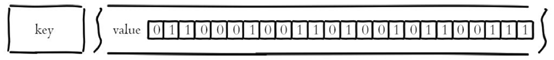
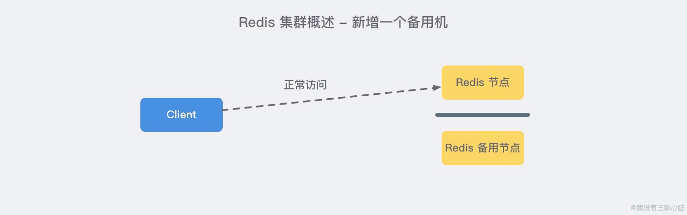
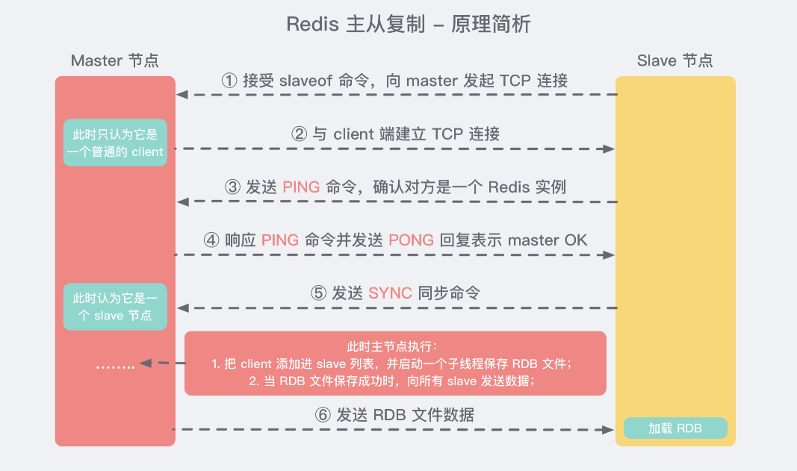
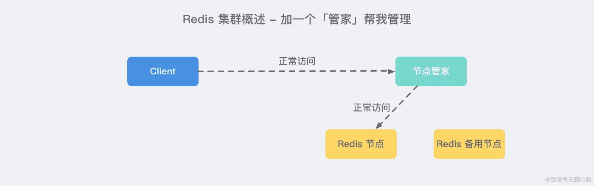
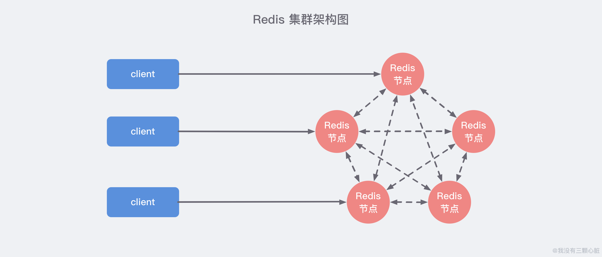
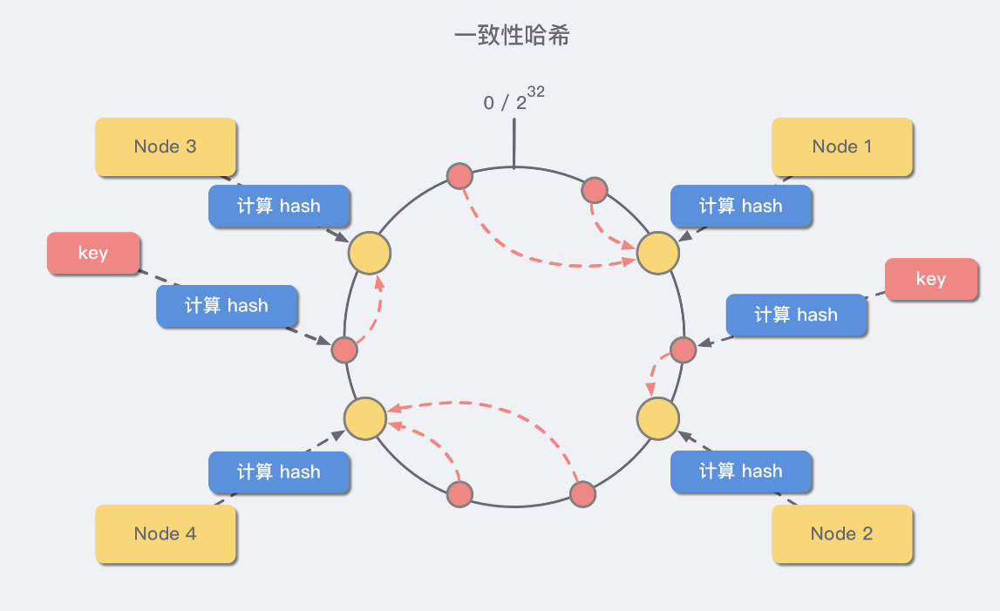
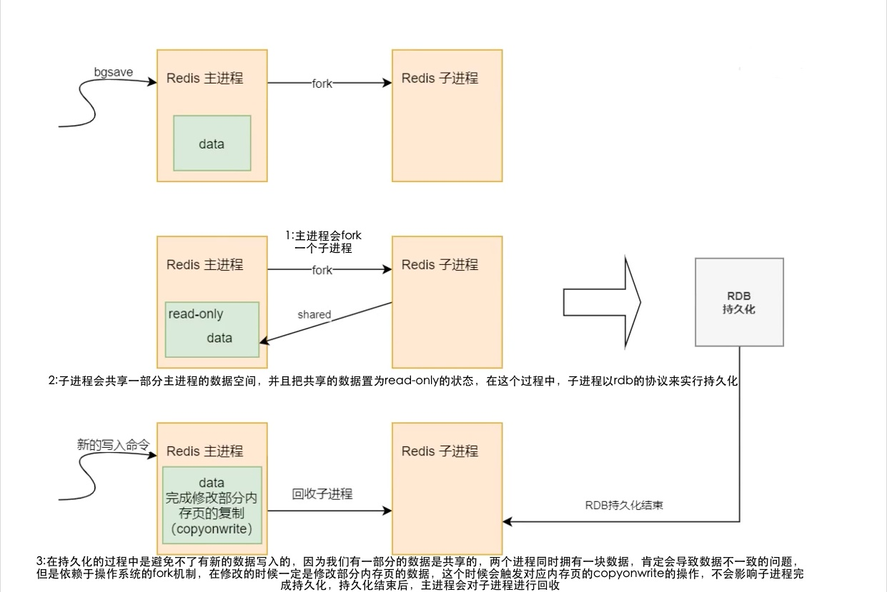
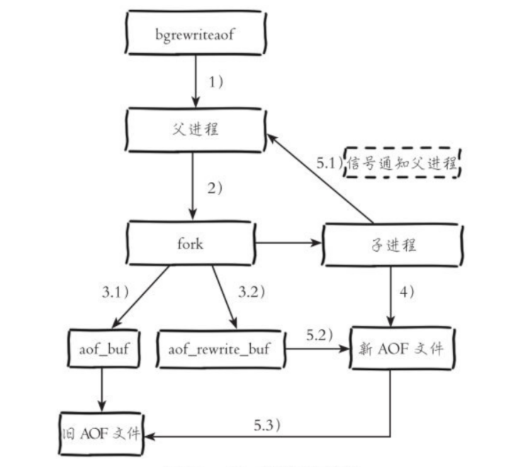

# 本项目为基本的 Redis demo

## 基本情况

* JDK：1.8.0_181
* jedis：2.9.0
* redis：5.0.7

## 基本数据类型与命令行

### 通用命令行：

* **DEL key [key ...]** 删除
* **MOVE key db** 将key移动到某个db
* **EXISTS key** 查看key是否存在
* **EXPIRE key seconds** 设置key过期时间
* **KEYS pattern** 过滤key
* **TTL key** 获取对应key的过期时间

### 字符串（Strings）

* **SET key value [EX seconds] [PX milliseconds] [NX|XX]**
  
  1. EX 设置过期时间 秒
  2. PX 设置过期时间 毫秒
  3. NX 当key不存在时才设置
  4. XX 当key存在时才设置
  5. return 成功：OK 失败：nil（null）
  
* **GET key**
  1. 获取value
  2. 存在key，返回value，否则返回null
  
* **SETEX key seconds value**
  
  1.  等同于SET EX
  
* **SETNX key value**
  1. 等同于SET NX
  2. 不建议使用，因为无法设置过期时间，一般使用SET 命令
  
* **INCR key**/**INCRBY key increment**/**INCRBYFLOAT key increment**
  1. 为key加1/INCRBY则增加指定数值/增加浮点数
  2. 如果key不存在，会先将 `key` 的值设为 `0` ，再执行加法操作
  
* **DECR key**/**DECRBY key decrement**
  
  1. 为key减1
  2. 如果key不存在，会先将 `key` 的值设为 `0` ，再执行减法法操作
  
* **MSET key value [key value ...]**
  
  1. 批量设置 kv
  
* **MGET key [key ...]**

  1. 批量获取key

  

### 散列（hashes->map）

* **HSET key field value**/**HMSET key field value [field value ...]**
  1. 成功返回1或者N，失败返回0
* **HGET key field**/**HGETALL key**
  1. 通过key field 获取 value
  2. 通过key获取所有的field和value，在java中是一个Map<String,String>

### 列表（lists）

* **LPUSH key value [value ...]**/**RPUSH key value [value ...]**

  1. 从左或者从右侧，往list中放入一个value
  2. 当key不存在，则创建一个队列

* **LRANGE key start stop**

  1. 从左边获取某list的value
  2. 没有Rrange命令

* **LPOP key**/**RPOP key**

  1. 弹出左/右的第一个元素

* **LINDEX key index**

  1. 获取从左边开始第index个value

* **LPUSHX key value**/**RPUSHX key value**

  1. 从左边/右边插入一个value
  2. 当有且是队列时候才会插入，否则不插入

* **LREM key count value**

  1. count >0 从表头开始搜索，移除与value相等的count个
  2. count<0 从表尾开始搜索，移除与value相等的count的绝对值个
  3. count=0 移除所有value

* **LTRIM key start stop**

  1. 只保留 start stop区间的value
  2. -1表示倒数1，-2表示倒数2

* **LSET key index value**

  1. 设置某个位置的value
  2. 超出范围或者list不存在，报错

* **LINSERT key BEFORE|AFTER pivot value**

  1. 插入到某个value前/后

  

### 集合（sets）

set是一个集合，自动除重

* **SADD key member [member ...]**

  1. 往一个集合里面添加N个value

* **SCARD key**

  1. 返回set中个数

* **SDIFF key [key ...]**/**SDIFFSTORE destination key [key ...]**

  1. 返回差集

  2. 将差集返回，并且保存到destination中（覆盖，当destination不是set时，不进行覆盖，单貌似会删除原始值）

* **SINTER key [key ...]**/**SINTERSTORE destination key [key ...]**
  1. 返回交集
  2. 将交集返回，并且保存到destination中（覆盖，当destination不是set时，不进行覆盖，单貌似会删除原始值）

### 有序集合（sorted sets）

* **ZADD key score member [[score member] [score member] ...]**
  1. 向集合里面添加value，score是其权重
* **ZRANGE key start stop [WITHSCORES]**
  1. 返回排序，score升序
  2. start stop 包含关系，并且为index
  3. stop 为-1表示是最后一个元素，-2倒数第二个
* **ZRANGEBYSCORE key min max [WITHSCORES] [LIMIT offset count]**
  1. min max 是score的值区间
  2. WITHSCORES是返回带score
  3. LIMIT为取几个
* **ZRANK key member**
  1. 返回排名，升序排列

#### 数据结构

跳表

## 特殊数据类型

### bitmaps



可以用于布隆过滤器

* **SETBIT key offset value**
  1. 这个相当于一个hash表，无限长度
  2. offset相当于下标值
* **GETBIT key offset**
* **BITCOUNT key [start end]**
  1. 统计1的个数


### hyperloglogs

基数：

比如数据集 {1, 3, 5, 7, 5, 7, 8}， 那么这个数据集的基数集为 {1, 3, 5 ,7, 8}, 基数(不重复元素)为5。 基数估计就是在误差可接受的范围内，快速计算基数。

存在误差

特点：占用内存小

用途：

1. 统计UV数量
2. 统计在线用户数
3. 统计....

一般处理统计相关，且数据量大，且容忍一定误差。

* **PFADD key element [element ...]**

  1. 往集合里面添加基数
  2. 重复元素则不会被放入

* **PFCOUNT key [key ...]**

  1. 计算某个pf集合个数
  2. 多个key则求并集个数

* **PFMERGE destkey sourcekey [sourcekey ...]**

  1. 合并多个pf集合
  2. 求并集

  

### geospatial地理位置

附近的人

* **GEOADD key longitude latitude member [longitude latitude member ...]**

  1. longitude 经度
  2. latitude 纬度
  3. member value

* **GEOPOS key member [member ...]**

  1. 获取member的经纬度信息

* **GEODIST key member1 member2 [unit]**

  1. 计算两个位置之间的直线距离
  2. 通过经纬度计算
  3. unit可选 m（米） km（千米） mi（英里）ft（英尺）

* **GEORADIUS key longitude latitude radius m|km|ft|mi [WITHCOORD] [WITHDIST] [WITHHASH] [COUNT count]**

  1. 通过当前经纬度，查询附近的人
  2. radius指定直线距离
  3. m|km|ft|mi 指定距离单位
  4. WITHCOORD 返回经纬度信息
  5. WITHDIST返回直线距离信息
  6. WHTHHASH
  7. COUNT 返回个数

  

## Redis事务

### ACID

* A:原子
* C:一致
* I:隔离
* D:持久

### redis中的事务：一次性、顺序性、排他性地执行一些命令。

* 开启事务
  1. **MULTI** 开启事务命令
* 命令入队
  1. 在命令队列中，及时有书写错的命令，也不会有问题
* 执行事务
  1. **EXEC** 执行命令
* 放弃事务
  1. **DISCARD**
  2. 放弃事务之后，队列中的命令都不会被执行
* 监视器
  1. **WATCH key [key ...]**
  2. **UNWATCH**  事务失败需要解锁
### 用途：


## 基于Redis的分布式锁

分布式锁，即分布式系统下，需要访问一个共享资源，这个资源在同一时刻只能有一个使用者。

因此需要第三方维护一个“锁”的东西，大家都可以访问到，当谁持有这个“锁”，就能访问资源。

Java中常见的三种分布式锁实现：

1. **基于 MySQL 中的锁**：MySQL 本身有自带的悲观锁 `for update` 关键字，也可以自己实现悲观/乐观锁来达到目的；
2. **基于 Zookeeper 有序节点**：Zookeeper 允许临时创建有序的子节点，这样客户端获取节点列表时，就能够当前子节点列表中的序号判断是否能够获得锁；
3. **基于 Redis 的单线程**：由于 Redis 是单线程，所以命令会以串行的方式执行，并且本身提供了像 `SETNX(set if not exists)` 这样的指令，本身具有互斥性；

### Redis中分布式锁存在的问题

#### 锁超时

https://www.wmyskxz.com/2020/03/01/redis-3/#Java-%E4%B8%AD%E5%AE%9E%E7%8E%B0%E7%9A%84%E5%B8%B8%E8%A7%81%E6%96%B9%E5%BC%8F

## LUA脚本


## Redis发布/订阅

- 监听到订阅模式接受到消息时的回调 (onPMessage)
- 监听到订阅频道接受到消息时的回调 (onMessage )
- 订阅频道时的回调( onSubscribe )
- 取消订阅频道时的回调( onUnsubscribe )
- 订阅频道模式时的回调 ( onPSubscribe )
- 取消订阅模式时的回调( onPUnsubscribe )

可以使用基于发布订阅模式做一个：配置中心， list+发布订阅=队列

### 配置中心


### 消息队列


## Redis集群

### 单机模式

Redis最开始是单机模式，只有一个节点对外提供服务

### 主从复制

为了避免只有一个节点，当节点挂掉之后服务不可用的情况，需要另外一个节点作为备用，当主节点不可用的时候，将手动调整连接至备用节点。

备用节点相当于数据的冗余。

主从复制的数据是单向的，只能从主节点到从节点，且从节点是只读的。

如果在这里想要做读写分离，则需要自己手动生成两个连接池，写到主节点，从从节点读取。




当主节点挂掉之后，登录从节点，`slaveof no one`将该节点提升为主节点，当还有其他从节点时，可以使用相同命令，设置从被提升的节点进行复制，当挂掉节点启动的时候，可以使用`slaveof`从当前主节点复制即可。

不过这里客户端的连接需要重新断开，然后连接新的master节点，因为其他所有的备用节点都是只读的。

主从复制的主要作用：

* **数据冗余：** 主从复制实现了数据的热备份，是持久化之外的一种数据冗余方式。
* **故障恢复：** 当主节点出现问题时，可以由从节点提供服务，实现快速的故障恢复 *(实际上是一种服务的冗余)*。
* **负载均衡：** 在主从复制的基础上，配合读写分离，可以由主节点提供写服务，由从节点提供读服务 *（即写 Redis 数据时应用连接主节点，读 Redis 数据时应用连接从节点）*，分担服务器负载。尤其是在写少读多的场景下，通过多个从节点分担读负载，可以大大提高 Redis 服务器的并发量。
* **高可用基石：** 除了上述作用以外，主从复制还是哨兵和集群能够实施的 **基础**，因此说主从复制是 Redis 高可用的基础。

#### 主从复制基本原理



主节点主要是发送rdb文件，像slave节点发送数据

发送SYNC命令是一个非常消耗资源的操作，主要有以下动作：

1. **主服务器** 需要执行 `BGSAVE` 命令来生成 RDB 文件，这个生成操作会 **消耗** 主服务器大量的 **CPU、内存和磁盘 I/O 的资源**；
2. **主服务器** 需要将自己生成的 RDB 文件 发送给从服务器，这个发送操作会 **消耗** 主服务器 **大量的网络资源** *(带宽和流量)*，并对主服务器响应命令请求的时间产生影响；
3. 接收到 RDB 文件的 **从服务器** 需要载入主服务器发来的 RBD 文件，并且在载入期间，从服务器 **会因为阻塞而没办法处理命令请求**；

特别是当出现 **断线重复制** 的情况是时，为了让从服务器补足断线时确实的那一小部分数据，却要执行一次如此耗资源的 `SYNC` 命令，显然是不合理的。

在2.8版本以后引入`PSYNC` 命令来代替 `SYNC`，它具有两种模式：

1. **全量复制：** 用于初次复制或其他无法进行部分复制的情况，将主节点中的所有数据都发送给从节点，是一个非常重型的操作；
2. **部分复制：** 用于网络中断等情况后的复制，只将 **中断期间主节点执行的写命令** 发送给从节点，与全量复制相比更加高效。**需要注意** 的是，如果网络中断时间过长，导致主节点没有能够完整地保存中断期间执行的写命令，则无法进行部分复制，仍使用全量复制；

### Redis  Sentinel（哨兵模式）

虽然主从复制仍然需要手动去更改连接地址，因此产生了哨兵模式，哨兵模式，就是有一个哨兵，定时去查看Redis主节点和备用节点的情况，当主节点宕机的时候，哨兵会自动切换到备用节点，让备用节点继续对外提供服务，有点类似于注册中心的感觉。



哨兵节点：特殊的redis节点，不存储数据，定时发送命令，让Redis各个实例返回其运行状态，当哨兵检测到Master节点宕机的时候，会将slave切换成master，通过`发布订阅模式`通知其他slave节点，修改配置（saveof命令），让他们切换主机。

但是发现当节点故障迁移的时候，如果哨兵节点与redis在本机，那么将会把master的ip改为一个127.0.0.1。导致远程无法正常连接，应该是需要一个域名映射或者是不能在一个主机上？

问题待解决。

多哨兵监控：

单个哨兵监控可能出现问题，因此可以使用多个哨兵进行监控，各个哨兵之间页可以进行监控。

#### 故障迁移

`故障切换（failover）`的过程。假设主服务器宕机，哨兵1先检测到这个结果，系统并不会马上进行failover过程，仅仅是哨兵1主观的认为主服务器不可用，这个现象成为主观下线。当后面的哨兵也检测到主服务器不可用，并且数量达到一定值时，那么哨兵之间就会进行一次投票，投票的结果由一个哨兵发起，进行failover操作。切换成功后，就会通过发布订阅模式，让各个哨兵把自己监控的从服务器实现切换主机，这个过程称为客观下线。这样对于客户端而言，一切都是透明的。

#### 主机挑选

**故障转移操作的第一步** 要做的就是在已下线主服务器属下的所有从服务器中，挑选出一个状态良好、数据完整的从服务器，然后向这个从服务器发送 `slaveof no one` 命令，将这个从服务器转换为主服务器。但是这个从服务器是怎么样被挑选出来的呢？

简单来说 Sentinel 使用以下规则来选择新的主服务器：

1. 在失效主服务器属下的从服务器当中， 那些被标记为主观下线、已断线、或者最后一次回复 PING 命令的时间大于五秒钟的从服务器都会被 **淘汰**。
2. 在失效主服务器属下的从服务器当中， 那些与失效主服务器连接断开的时长超过 down-after 选项指定的时长十倍的从服务器都会被 **淘汰**。
3. 在 **经历了以上两轮淘汰之后** 剩下来的从服务器中， 我们选出 **复制偏移量（replication offset）最大** 的那个 **从服务器** 作为新的主服务器；如果复制偏移量不可用，或者从服务器的复制偏移量相同，那么 **带有最小运行 ID** 的那个从服务器成为新的主服务器。

### Redis Cluster（redis真集群模式）



Redis Cluster典型架构，集群中的每一个Redis任意两个节点都相连，客户端连接到集群的任意一台，就可以对其他Redis节点进行读写操作

在这种模式下，有一个重要的概念：

Redis槽位

Redis中内置了`16384`个槽位（2的14次方。2字节16位，下面有详细介绍），这`16384`个槽位会分散在不同的节点之上。

当客户端连接到Redis集群之后，就会得到一分关于这个集群配置的信息，当客户端对某个key进行操作的时候，会先计算出这个key的`Hash`值，然后把这个结果对`16384`求余数，然后根据余数，如果该key不属于当前节点的槽位，则会使用`MOVED`命令进行redis节点跳转，去对应的节点进行操作。

集群模式的主要作用：

1. **数据分区：** 数据分区 *(或称数据分片)* 是集群最核心的功能。集群将数据分散到多个节点，**一方面** 突破了 Redis 单机内存大小的限制，**存储容量大大增加**；**另一方面** 每个主节点都可以对外提供读服务和写服务，**大大提高了集群的响应能力**。Redis 单机内存大小受限问题，在介绍持久化和主从复制时都有提及，例如，如果单机内存太大，`bgsave` 和 `bgrewriteaof` 的 `fork` 操作可能导致主进程阻塞，主从环境下主机切换时可能导致从节点长时间无法提供服务，全量复制阶段主节点的复制缓冲区可能溢出……
2. **高可用：** 集群支持主从复制和主节点的 **自动故障转移** *（与哨兵类似）*，当任一节点发生故障时，集群仍然可以对外提供服务。

redis-cli --cluster create --cluster-replicas 1 127.0.0.1:7000 127.0.0.1:7001 127.0.0.1:7002 127.0.0.1:7003 127.0.0.1:7004 127.0.0.1:7005

--replicas 1 希望集群中的每个主节点创建一个从节点

#### 数据分区方案简析

##### 哈希值 % 节点数

哈希取余分区思路非常简单：计算 `key` 的 hash 值，然后对节点数量进行取余，从而决定数据映射到哪个节点上。

不过该方案最大的问题是，**当新增或删减节点时**，节点数量发生变化，系统中所有的数据都需要 **重新计算映射关系**，引发大规模数据迁移。

##### 一致性哈希分区

一致性哈希算法将 **整个哈希值空间** 组织成一个虚拟的圆环，范围是 *[0 - 232 - 1]*，对于每一个数据，根据 `key` 计算 hash 值，确数据在环上的位置，然后从此位置沿顺时针行走，找到的第一台服务器就是其应该映射到的服务器：



与哈希取余分区相比，一致性哈希分区将 **增减节点的影响限制在相邻节点**。以上图为例，如果在 `node1` 和 `node2` 之间增加 `node5`，则只有 `node2` 中的一部分数据会迁移到 `node5`；如果去掉 `node2`，则原 `node2` 中的数据只会迁移到 `node4` 中，只有 `node4` 会受影响。

一致性哈希分区的主要问题在于，当 **节点数量较少** 时，增加或删减节点，**对单个节点的影响可能很大**，造成数据的严重不平衡。还是以上图为例，如果去掉 `node2`，`node4` 中的数据由总数据的 `1/4` 左右变为 `1/2` 左右，与其他节点相比负载过高。

##### 带有虚拟节点的一致性哈希分区

该方案在 **一致性哈希分区的基础上**，引入了 **虚拟节点** 的概念。Redis 集群使用的便是该方案，其中的虚拟节点称为 **槽（slot）**。槽是介于数据和实际节点之间的虚拟概念，每个实际节点包含一定数量的槽，每个槽包含哈希值在一定范围内的数据。

在使用了槽的一致性哈希分区中，**槽是数据管理和迁移的基本单位**。槽 **解耦** 了 **数据和实际节点** 之间的关系，增加或删除节点对系统的影响很小。仍以上图为例，系统中有 `4` 个实际节点，假设为其分配 `16` 个槽(0-15)；

- 槽 0-3 位于 node1；4-7 位于 node2；以此类推….

如果此时删除 `node2`，只需要将槽 4-7 重新分配即可，例如槽 4-5 分配给 `node1`，槽 6 分配给 `node3`，槽 7 分配给 `node4`；可以看出删除 `node2` 后，数据在其他节点的分布仍然较为均衡。

## 节点通信机制简析

#### 两个端口

在 **哨兵系统** 中，节点分为 **数据节点** 和 **哨兵节点**：前者存储数据，后者实现额外的控制功能。在 **集群** 中，没有数据节点与非数据节点之分：**所有的节点都存储数据，也都参与集群状态的维护**。为此，集群中的每个节点，都提供了两个 TCP 端口：

- **普通端口：** 即我们在前面指定的端口 *(7000等)*。普通端口主要用于为客户端提供服务 *（与单机节点类似）*；但在节点间数据迁移时也会使用。
- **集群端口：** 端口号是普通端口 + 10000 *（10000是固定值，无法改变）*，如 `7000` 节点的集群端口为 `17000`。**集群端口只用于节点之间的通信**，如搭建集群、增减节点、故障转移等操作时节点间的通信；不要使用客户端连接集群接口。为了保证集群可以正常工作，在配置防火墙时，要同时开启普通端口和集群端口。

#### Gossip 协议

节点间通信，按照通信协议可以分为几种类型：单对单、广播、Gossip 协议等。重点是广播和 Gossip 的对比。

- 广播是指向集群内所有节点发送消息。**优点** 是集群的收敛速度快(集群收敛是指集群内所有节点获得的集群信息是一致的)，**缺点** 是每条消息都要发送给所有节点，CPU、带宽等消耗较大。
- Gossip 协议的特点是：在节点数量有限的网络中，**每个节点都 “随机” 的与部分节点通信** *（并不是真正的随机，而是根据特定的规则选择通信的节点）\*，经过一番杂乱无章的通信，每个节点的状态很快会达到一致。Gossip 协议的 **优点*** 有负载 **(比广播)** 低、去中心化、容错性高 *(因为通信有冗余)* 等；**缺点** 主要是集群的收敛速度慢。

#### 消息类型

集群中的节点采用 **固定频率（每秒10次）** 的 **定时任务** 进行通信相关的工作：判断是否需要发送消息及消息类型、确定接收节点、发送消息等。如果集群状态发生了变化，如增减节点、槽状态变更，通过节点间的通信，所有节点会很快得知整个集群的状态，使集群收敛。

节点间发送的消息主要分为 `5` 种：`meet 消息`、`ping 消息`、`pong 消息`、`fail 消息`、`publish 消息`。不同的消息类型，通信协议、发送的频率和时机、接收节点的选择等是不同的：

- **MEET 消息：** 在节点握手阶段，当节点收到客户端的 `CLUSTER MEET` 命令时，会向新加入的节点发送 `MEET` 消息，请求新节点加入到当前集群；新节点收到 MEET 消息后会回复一个 `PONG` 消息。
- **PING 消息：** 集群里每个节点每秒钟会选择部分节点发送 `PING` 消息，接收者收到消息后会回复一个 `PONG` 消息。**PING 消息的内容是自身节点和部分其他节点的状态信息**，作用是彼此交换信息，以及检测节点是否在线。`PING` 消息使用 Gossip 协议发送，接收节点的选择兼顾了收敛速度和带宽成本，**具体规则如下**：(1)随机找 5 个节点，在其中选择最久没有通信的 1 个节点；(2)扫描节点列表，选择最近一次收到 `PONG` 消息时间大于 `cluster_node_timeout / 2` 的所有节点，防止这些节点长时间未更新。
- **PONG消息：** `PONG` 消息封装了自身状态数据。可以分为两种：**第一种** 是在接到 `MEET/PING` 消息后回复的 `PONG` 消息；**第二种** 是指节点向集群广播 `PONG` 消息，这样其他节点可以获知该节点的最新信息，例如故障恢复后新的主节点会广播 `PONG` 消息。
- **FAIL 消息：** 当一个主节点判断另一个主节点进入 `FAIL` 状态时，会向集群广播这一 `FAIL` 消息；接收节点会将这一 `FAIL` 消息保存起来，便于后续的判断。
- **PUBLISH 消息：** 节点收到 `PUBLISH` 命令后，会先执行该命令，然后向集群广播这一消息，接收节点也会执行该 `PUBLISH` 命令。

## Redis持久化

### RDB

rdb是将Redis中的内存数据保存到一个RDB文件中，也叫`快照持久化`，内容主要保存的KV

#### 触发机制：save，bgsave

* save 命令会阻塞Redis服务器主进程，直到文件创建完毕为止
* bgsvae 会frok

#### 自动触发：配置文件

```bash
save 900 1  # 900S内 有1个key变化
save 300 10 # 300S内 有10个key变化
save 60 10000  # 60S内 有1W个key变化
```

RDB文件是为了在Redis服务器进程重新启动以后，还原之前存储在Redis中的数据，没有专门命令去加载RDB文件，一般伴随这Redis服务器启动时自动加载。

#### 生成RDB文件的过程

1. Redis主进程fork出一份子进程，fork完成之后，主进程继续对外提供读写服务，子进程去执行save操作
2. 由于主进程可能随时会更改内存数据结构，因此子进程保存的数据并不是实时的，保存期间的其他更改操作会丢失数据

知识点：fork()，exec()

由于这数据并不是最新的，因此rdb的文件也叫`快照`

#### 优点

1. RDB是一个紧凑的文件，保存了某个时间节点上的所有数据集，适合用于备份
2. RDB在恢复的时候比较快
3. fork出子进程来处理所有保存工作，主进程不需要任何磁盘IO操作

#### 缺点

1. RDB无法做到实时持久化
2. 每次bgsave过程都要fork子进程，频繁创建成本过高。
3. fork之后如果有大量更新操作，会产生大量内存分页错误（cory on write机制）

#### 图




### AOF

AOF文件主要保存的是Redis服务器的写命令，当服务器重启，Redis只要从头到尾执行一次AOF文件包含的命令，就能恢复到最新的数据集了。

#### 基本命令

```bash
appendonly yes #开启aof 默认为 no

appendfsync always #表示每次更新操作后手动调用fsync()将数据写入到磁盘
appendfsync everysec #表示每秒同步一次(折中方案，默认值)
appendfsync no  #表述等操作系统进行数据缓存同步到磁盘(快速响应客户端，不对AOF做数据同步，同步文件由操作系统负责，通常同步周期最长30S)
```

#### 载入AOF文件

1. 创建一个伪客户端
2. 从AOF文件中读取一条命令
3. 写入到Redis服务器中
4. 重复2、3直到文件结束

#### 优点

1. 可以保存秒级的命令，数据的实时性更高
2. 采用append模式，及时在写入过程中宕机，也不会破坏日志文件中已经存在的内容

#### 缺点

1. 由于需要每秒保存更新命令，日积月累会导致AOF文件较大。
2. 恢复速度不如RDB文件

AOF重写

由于AOF过大，因此引入了AOF重写机制，压缩AOF文件体积

```bash
auto-aof-rewrite-percentage 100 # 默认 100 当目前aof 文件大小超过上一次重写的aof 文件大小的百分之多少进行重写，即当aof 文件增长到一定大小的时候，Redis 能够调用bgrewriteaof对日志文件进行重写。当前AOF 文件大小是上次日志重写得到AOF 文件大小的二倍（设置为100）时，自动启动新的日志重写过程。
auto-aof-rewrite-min-size 64mb #设置允许重写的最小aof 文件大小，避免了达到约定百分比但尺寸仍然很小的情况还要重写
```

```bash
set a a
set a b
set a c
```

假设有以上命令，则AOF会直接生成3条命令进行保存，当体积过大时候，就会对内存遍历，将内存中的KV键值对，保存成相对应的命令，取代之前的多条`SET`记录，成为`SET a c`这条命令。

##### 需要注意的点

1. redis不希望在AOF重写期间阻塞主线程，因此原理基本与生成RDB文件类似，fork出子进程，然后主进程继续提供服务，子进程会进行AOF命令
2. 由于主线程同时也在对外提供读写服务，必定会导致数据变更，由于fork出的子进程也是类似于快照内存，因此需要主线程启动一个AOF重写缓冲区，将重写期间的命令写入缓冲区中，当子线程更新完AOF文件之后，主线程再将AOF缓冲区的重写命令添加到重写的AOF文件，最后再替换旧的AOF文件，完成重写



### 混合持久化

Redis 4.0以后支持混合持久化

## Redis删除策略

### 定期删除

Redis会为每个设置了过期时间的key放入一个独立的集合中，以后会定期遍历进行删除到期的key。

默认每秒10次过期扫描，扫描过程并不会遍历所有的key，而是是采用了一种简单的贪心策略：

1. 从过期字典中随机 20 个 key；

2. 删除这 20 个 key 中已经过期的 key；

3. 如果过期的 key 比率超过 1/4，那就重复步骤 1；

### 惰性删除

惰性删除即在客户端访问这个key的时候，redis对key的过期时间进行检查，如果过期了就立即删除，并返回空。

## Redis内存淘汰策略

因为缓存大部分都不能过期立即删除，那么就可能存在部分key过期了，还存在内存中，导致内存爆满，因此需要内存淘汰策略：

Redis中可以为key设置有效期，当有效期过了之后，并不是立即删除。

* **volatile-lru（least recently used）**：从已设置过期时间的数据集（server.db[i].expires）中挑选最近最少使用的数据淘汰
* **volatile-ttl**：从已设置过期时间的数据集（server.db[i].expires）中挑选将要过期的数据淘汰
* **volatile-random**：从已设置过期时间的数据集（server.db[i].expires）中任意选择数据淘汰
* **allkeys-lru（least recently used）**：当内存不足以容纳新写入数据时，在键空间中，移除最近最少使用的 key（这个是最常用的）
* **allkeys-random**：从数据集（server.db[i].dict）中任意选择数据淘汰
* **no-eviction**：禁止驱逐数据，也就是说当内存不足以容纳新写入数据时，新写入操作会报错。这个应该没人使用吧！

4.0 版本后增加以下两种：

* **volatile-lfu（least frequently used）**：从已设置过期时间的数据集(server.db[i].expires)中挑选最不经常使用的数据淘汰
* **allkeys-lfu（least frequently used）**：当内存不足以容纳新写入数据时，在键空间中，移除最不经常使用的 key

FIFI、LRU、LFU算法：

https://www.cnblogs.com/hongdada/p/10406902.html


## 16384槽位

https://github.com/redis/redis/commit/ebd666d

https://github.com/redis/redis/issues/2576

https://www.jianshu.com/p/de268f62f99b

https://zhuanlan.zhihu.com/p/80335611

http://www.go2live.cn/nocate/%E4%B8%BA%E4%BB%80%E4%B9%88rediscluster%E9%87%87%E7%94%A816384%E4%B8%AA%E6%A7%BD%E4%BD%8D.html

## 缓存穿透、击穿、雪崩

### 穿透（缓存key无值）

缓存穿透就是没从通过某key从redis服务器中获取不到对应的数据，而导致流量直接打到DB，增加了DB的压力

解决：采用布隆过滤器；缓存空结果

### 击穿（一个key过期，大量请求）

在Redis缓存key过期的瞬间，大量的请求打到DB

解决：分布式锁，只有一个线程去家在数据

### 雪崩（redis宕机）

当缓存服务器重启或者大量缓存集中在某一个时间段失效

解决：服务降级、数据预热（大量key集中过期）

ref https://baijiahao.baidu.com/s?id=1655304940308056733&wfr=spider&for=pc

## 引用

ref:


https://www.wmyskxz.com/2020/03/17/redis-9-shi-shang-zui-qiang-ji-qun-ru-men-shi-jian-jiao-cheng/#%E7%AC%AC%E4%B8%89%E6%AD%A5%EF%BC%9A%E6%BC%94%E7%A4%BA%E6%95%85%E9%9A%9C%E8%BD%AC%E7%A7%BB

