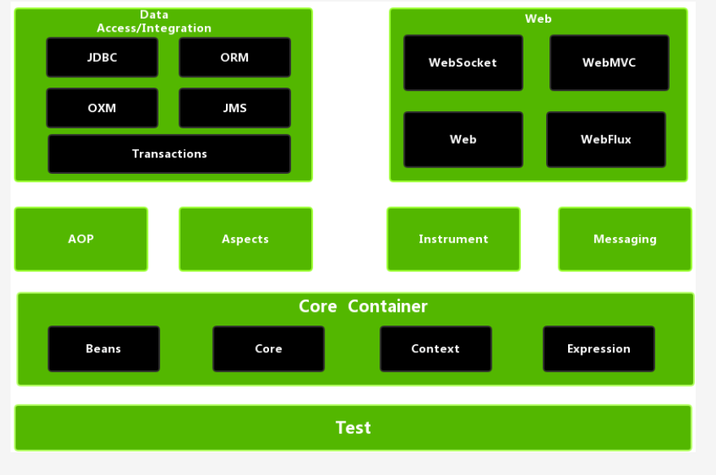
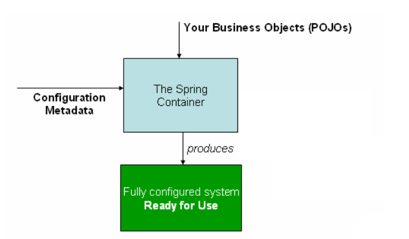
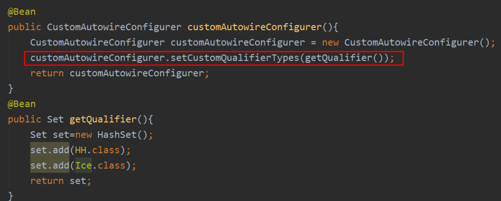

# 本项目为基本的 Spring5 demo

## 基本情况

* JDK：1.8.0_181
* Spring：5.2.0.RELEASE
* 优先学习XML方式，因为XML是起源，当XML方式都弄懂之后，注解只不过是XML方式的变种

## Spring基本架构



## IOC容器

主要介绍控制反转与IOC容器

Spring 基础模块

* Beans 解析XML中bean标签，提供BeanFactory，工厂模式
* Core 基础模块，提供控制控制反转和依赖注入功能
* Context  上下文模快，它以一种类似于 JNDI 注册的方式访问对象。Context 模块继承自 Bean 模块，并且添加了国际化（比如，使用资源束）、事件传播、资源加载和透明地创建上下文（比如，通过 Servelet 容器）等功能。Context 模块也支持 Java EE 的功能，比如 EJB、JMX 和远程调用等。**ApplicationContext** 接口是 Context 模块的焦点。**spring-context-support** 提供了对第三方集成到 Spring 上下文的支持，比如缓存（EhCache, Guava, JCache）、邮件（JavaMail）、调度（CommonJ, Quartz）、模板引擎（FreeMarker, JasperReports, Velocity）等。
* Expression 模块提供了强大的表达式语言，用于在运行时查询和操作对象图。

### IOC和bean简介

IoC（Inversion of Control）称为`控制反转`，主要是一种设计思想。把对象的控制权交给容器去控制。

DI（Dependency Injection）称为`依赖注入`，组件之间的关系是由容器在运行期决定的，

beans、context是Spring框架IoC的基础。

`BeanFactory`接口提供了一种高级配置机制，能够管理任何类型的对象ApplicationContext是BeanFactory的一个子类，主要增加了以下几点功能：

* 与Spirng AOP功能轻松集成
* 消息资源处理
* 事件发布
* 特定用于Web程序的上下文，ApplicationContext

### 容器概述

`org.springframework.context.ApplicationContext`接口代表Spring IoC容器，负责实例化、装配、注入bean。

Context主要有以下几种主要实现：

* FileSystemXmlApplicationContext 基于文件系统的XML上下文（可以写绝对路径）
* ClassPathXmlApplicationContext  基于类路径的XML上下文（相对路径）
* AnnotationConfigApplicationContext  基于注解的上下文（Spring Boot 应该就是从这里开始加载的）
* WebApplicationContext （用于Web程序，在Spring Web中）

Spring的工作视图



#### 配置元数据

* 基于XML的配置，更加直观
* 基于注解的配置：spring 2.5 XML+ `<context:annotation-config/>`
* 基于Java的配置：spring 3 `@Configuration`、`Bean`、`Import`等

Spring支持记在多个context（一个XML是一个Context还是多个XML会合并成一个Context？），并且支持两个XML中互相注入。

PS: XML中配置properties注入是基于setter方法的，如果没写set方法，则会报错。

使bean定义跨越多个XML文件可能很有用。通常，每个单独的XML配置文件都代表体系结构中的逻辑层或模块。

#### 使用容器

`ApplicationContext`是一个维护bean定义与相互依赖的注册表的高级工厂接口，主要通过`getBean`方法获取实例对象。

### Bean总览

IoC容器可以管理一个或多个bean，这学bean定义表示为`BeanDefinition`对象，其中包含：

* 包限定的类名称
* bean行为配置：作用域，生命周期，回调函数
* 依赖
* 各种连接池配置信息

IoC容器支持用户往容器里面注册一些自己创建的对象，通过上下文获取`beanFactory`，通过`registerBeanDefinition(String beanName, BeanDefinition beanDefinition)`和`registerSingleton(String beanName, Object singletonObject)`两个方法注册。

#### Bean命名

每个Bean都有一个或多个标识，只能具有一个唯一标识（XML配置中为id配置项）。

bean命名约定：

>约定是在命名bean时将标准Java约定用于实例字段名称。也就是说，bean名称以小写字母开头，并从那里用驼峰式大小写。

在XML中，bean可以使用以下标签启用多个名称

```xml
<alias name="" alias=""></alias>
```

#### 实例化bean

bean定义本质上创建一个或多个对象的方法。

基于XML的配置，则是`class`属性指定的完全限定名，主要通过以下两种方式使用该属性：

* 通过反射，调用其构造函数，直接创建bean
* 如果指定了工厂类，则调用工厂类的相关方法。

使用构造器实例化：

推荐

使用静态工厂：

需要写一个工厂类，生产对应的方法跟使用`@Bean`的时候有点像

```xml
<bean id="clientService"
    class="examples.ClientService"
    factory-method="createInstance"/>
<!-- class 是工厂的完全限定名 factory-method是生产bean的方法 -->
```

```java
public class ClientService {
    private static ClientService clientService = new ClientService();
    private ClientService() {}

    public static ClientService createInstance() {
        return clientService;
    }
}
```

使用实例工厂：

```xml
<!-- the factory bean, which contains a method called createInstance() -->
<bean id="serviceLocator" class="examples.DefaultServiceLocator">
    <!-- inject any dependencies required by this locator bean -->
</bean>
<!-- 需要对 bean 进行实例化 -->
<!-- the bean to be created via the factory bean -->
<bean id="clientService"
    factory-bean="serviceLocator"
    factory-method="createClientServiceInstance"/>

<!-- factory-bean是工厂bean,factory-method是生成方法 -->
```

```java
public class DefaultServiceLocator {

    private static ClientService clientService = new ClientServiceImpl();

    public ClientService createClientServiceInstance() {
        return clientService;
    }
}
```

### 依赖关系

需要对象进行协同工作。

#### 依赖注入

依赖注入（DI）是一个过程，通过该过程，对象只能公国构造参数，工厂方法参数或在构造或创建对象实例化以后在对象实例上设置的属性来确定其依赖关系。

DI存在两个主要变体：

* 基于构造函数
* 基于Setter方法

##### 基于构造函数

```xml
<bean id="beanOne" class="x.y.ThingOne">
    <constructor-arg ref="beanTwo"/>
    <constructor-arg ref="beanThree"/>
</bean>
<bean id="exampleBean" class="examples.ExampleBean">
    <constructor-arg type="int" value="7500000"/>
    <constructor-arg type="java.lang.String" value="42"/>
</bean>
<bean id="exampleBean" class="examples.ExampleBean">
    <constructor-arg index="0" value="7500000"/>
    <constructor-arg index="1" value="42"/>
</bean>
<bean id="exampleBean" class="examples.ExampleBean">
    <constructor-arg name="years" value="7500000"/>
    <constructor-arg name="ultimateAnswer" value="42"/>
</bean>
<!-- 以上方法都可以进行 构造器注入 index 从 0 开始 -->
```

可以配合`@ConstructorProperties`使用

https://blog.csdn.net/wslyk606/article/details/78861999

##### 基于Setter

```xml
<bean id="exampleBean" class="examples.ExampleBean">
    <property name="x" value="1"></property>
    <property name="y" value="2"></property>
</bean>
```

使用`property`属性设置，调用的是Setter方法

##### 依赖解析过程

1. 使用ApplicationContext描述所有bean的配置元数据创建和初始化。
2. 将bean的依赖关系都以属性、构造函数参数、工厂方法参数等表示，实际创建的时候，这些依赖都会提供给bean。
3. 每个属性或者构造函数参数都要设置值或bean的引用
4. 每个值的属性或者构造函数都将从其指定的格式转换为该属性或构函数参数的时机类型。Spring能够以String类型提供值转换成所有内置类型，比如int， long，String，boolean，等等。

##### 循环依赖

ref：

#### 懒加载

```xml
<bean id="lazy" class="com.something.ExpensiveToCreateBean" lazy-init="true"/>
<beans default-lazy-init="true">
    <!-- no beans will be pre-instantiated... -->
</beans>
```

#### 自动装配

```xml
<bean class="" id="" autowire=""></bean>
```

xml中的`bean`元素中的`autowire`：

|     模式      |                             说明                             |        调用        |
| :-----------: | :----------------------------------------------------------: | :----------------: |
|     `no`      |            默认，无自动装配，bean引用必须使用ref             |                    |
|   `byName`    |                   通过名称，且有setter方法                   | 无参构造器，setter |
|   `byType`    | 通过类型，如果存在多个类型，则存在问题，如果找不到，则不设置 | 无参构造器，setter |
| `constructor` |                 类似于`byType`，需要有构造器                 |     有参构造器     |

bean标签中设置了`autowire`属性的bean，则会进行自动寻找依赖且进行注入=`@Autowire`

### bean范围

|     范围      |                             描述                             |
| :-----------: | :----------------------------------------------------------: |
|  `singleton`  |                     默认，单例，全场唯一                     |
|  `prototype`  | 原型，任意数量的bean，且不存在于三级缓存中，容易产生循环依赖 |
|   `request`   |          每个HTTP请求，产生一个对象，仅在Web中使用           |
|   `session`   |         每个Session请求，产生一个对象，仅在Web中使用         |
| `application` |               在同一个`ServletContext`中为一个               |
|  `websocket`  |                    `websocket`期间为一个                     |


#### 单例范围

定义一个bean定义并且其作用域为单例时，Spring IoC容器将为该bean定义所定义的对象创建一个实例。该单个实例存储在此类单例bean的高速缓存中，并且对该命名bean的所有后续请求和引用都返回该高速缓存的对象。

#### 原型范围

每次对特定bean提出请求时，bean部署的非单一原型范围都会导致创建一个新bean实例。

#### 请求，会话，应用程序和WebSocket范围

在request，session，application，和websocket范围只有当你使用一个基于ApplicationContext的web的实现。

如果需要使用，则需要到web环境中使用，进行特殊配置。

`DispatcherServlet`、`RequestContextListener`、`RequestContextFilter`三者都是为了将HTTP请求对象绑定到对应处理请求的Thread中去

#### 小范围bean注入单例bean

单例bean中注入了一个代理对象。参考`HttpServletRequest`和`HttpServletResponse`俩对象

#### 自定义bean范围

实现`org.springframework.beans.factory.config.Scope`

对socpe进行注册

注解直接使用`@Configuration`

XML中需要进行配置：

```xml
<bean class="org.springframework.beans.factory.config.CustomScopeConfigurer">
    <property name="scopes">
        <map>
            <entry key="thread">
                <bean class="org.springframework.context.support.SimpleThreadScope"/>
            </entry>
        </map>
    </property>
</bean>
```

java中注册

```java
Scope threadScope = new SimpleThreadScope();
beanFactory.registerScope("thread", threadScope);
```

具体代码可以参考：https://github.com/waylau/spring-5-book/tree/master/samples/s5-ch02-custom-scope-annotation

### 定制化的bean

#### 生命周期回调

基于JDK的`@PostConstruct`和`@PreDestroy`，这两个是JDK原生注释，spring支持回调。

Spring中的接口

```java
import org.springframework.beans.factory.InitializingBean;
import org.springframework.beans.factory.DisposableBean;

void afterPropertiesSet() throw Exception;
void destroy() throw Exception;
```

XML中的配置

```xml
<bean id="ex" class="com.ex1.ex" init-method="init"/>
<bean id="ex" class="com.ex1.ex" destroy-method="destroy"/>
<beans default-init-method="" default-destroy-method="">
</beans>
```

注解中

`@Bean(initMethod = "",destroyMethod = "")`

回调方法顺序

1. 用注释的方法 `@PostConstruct`、 `@PreDestroy`
2. `afterPropertiesSet()`由`InitializingBean`回调接口定义；`destroy()`由`DisposableBean`回调接口定义
3. 定制配置的`init()`方法；定制配置的`destroy()`方法

#### LifeCycle

```java
import org.springframework.context.Lifecycle;

public interface Lifecycle{
  void start();
  void stop();
  boolean isRunning();
}

import org.springframework.context.LifecycleProcessor;

public interface LifecycleProcessor extends Lifecycle{
  void onRefresh();
  void onClose();
}
```

在spring管理的对象中，都能实现Lifecycle接口，当ApplicationContext接收到开始或者停止的信号的时候，会进行调用这些实现接口的类。

ps：LifecycleProcessor 是 Lifecycle 的增强类，看完doc觉得自己还没有使用到的情景，baidu之后发现一个不错的blog，从源码部分进行解析、总结。

先进行记录，尔后在进行详细的品读。

> https://blog.csdn.net/boling_cavalry/article/details/82051356

#### Spring钩子

```java
ConfigurableApplicationContext ctx = new ClassPathXmlApplicationContext("beans.xml");
// add a shutdown hook for the above context...
ctx.registerShutdownHook();
```

#### 各种Aware

`org.springframework.context.ApplicationContextAware`

提供`void setApplicationContext(ApplicationContext applicationContext) throws BeansException`回调

`org.springframework.beans.factory.BeanNameAware`

提供`void setBeanName(String name) throws BeansException;`回调

aware主要提供了Spring回调方法。

| 名称                             | 注入依赖                                                     | 在...中解释                                                  |
| :------------------------------- | :----------------------------------------------------------- | :----------------------------------------------------------- |
| `ApplicationContextAware`        | 宣告`ApplicationContext`。                                   | [`ApplicationContextAware` 和 `BeanNameAware`](https://docs.spring.io/spring-framework/docs/5.2.0.RELEASE/spring-framework-reference/core.html#beans-factory-aware) |
| `ApplicationEventPublisherAware` | 附件的事件发布者`ApplicationContext`。                       | [的其他功能 `ApplicationContext`](https://docs.spring.io/spring-framework/docs/5.2.0.RELEASE/spring-framework-reference/core.html#context-introduction) |
| `BeanClassLoaderAware`           | 类加载器，用于加载Bean类。                                   | [实例化豆](https://docs.spring.io/spring-framework/docs/5.2.0.RELEASE/spring-framework-reference/core.html#beans-factory-class) |
| `BeanFactoryAware`               | 宣告`BeanFactory`。                                          | [`ApplicationContextAware` 和 `BeanNameAware`](https://docs.spring.io/spring-framework/docs/5.2.0.RELEASE/spring-framework-reference/core.html#beans-factory-aware) |
| `BeanNameAware`                  | 声明bean的名称。                                             | [`ApplicationContextAware` 和 `BeanNameAware`](https://docs.spring.io/spring-framework/docs/5.2.0.RELEASE/spring-framework-reference/core.html#beans-factory-aware) |
| `BootstrapContextAware`          | `BootstrapContext`容器在其中运行的资源适配器。通常仅在支持JCA的`ApplicationContext`实例中可用。 | [JCA CCI](https://docs.spring.io/spring-framework/docs/5.2.0.RELEASE/spring-framework-reference/integration.html#cci) |
| `LoadTimeWeaverAware`            | 定义的编织器，用于在加载时处理类定义。                       | [在Spring Framework中使用AspectJ进行加载时编织](https://docs.spring.io/spring-framework/docs/5.2.0.RELEASE/spring-framework-reference/core.html#aop-aj-ltw) |
| `MessageSourceAware`             | 解决消息的已配置策略（支持参数化和国际化）。                 | [的其他功能 `ApplicationContext`](https://docs.spring.io/spring-framework/docs/5.2.0.RELEASE/spring-framework-reference/core.html#context-introduction) |
| `NotificationPublisherAware`     | Spring JMX通知发布者。                                       | [通知事项](https://docs.spring.io/spring-framework/docs/5.2.0.RELEASE/spring-framework-reference/integration.html#jmx-notifications) |
| `ResourceLoaderAware`            | 配置的加载程序，用于对资源的低级访问。                       | [资源资源](https://docs.spring.io/spring-framework/docs/5.2.0.RELEASE/spring-framework-reference/core.html#resources) |
| `ServletConfigAware`             | 当前`ServletConfig`容器在其中运行。仅在可感知网络的Spring中有效 `ApplicationContext`。 | [春季MVC](https://docs.spring.io/spring-framework/docs/5.2.0.RELEASE/spring-framework-reference/web.html#mvc) |
| `ServletContextAware`            | 当前`ServletContext`容器在其中运行。仅在可感知网络的Spring中有效 `ApplicationContext`。 | [春季MVC](https://docs.spring.io/spring-framework/docs/5.2.0.RELEASE/spring-framework-reference/web.html#mvc) |

### bean继承

Spring的XML中的继承是配置性属性可以将继承，而不是java体系内的继承关系

Bean定义可以包含许多配置信息，包括构造函数参数，属性值和特定于容器的信息，例如初始化方法，静态工厂方法名称等。子bean定义从父定义继承配置数据。

```xml
<bean id="parent" class="" abstract="true">
    <property name="name" value="para"></property>
    <property name="age" value="50"></property>
</bean>
<!-- 这里的如果配置了 abstract class 可以不写，是一个虚拟的class，仅仅启配置信息的作用，其他bean可以使用这些配置 -->
<bean id="son" class="com.nullbugs.spring.context.xml.ext.Son" parent="parent">
    <property name="name" value="son"></property>
</bean>
```

### bean扩展点

`org.springframework.beans.factory.config.BeanPostProcessor`

这个接口主要是定义了回调方法，可以自己覆盖容器默认的实例化逻辑、依赖关系解析逻辑。主要用于在Spring容器完成初始化，配置和初始化bean之后实现一些自有逻辑。

通过继续实现 ordered接口，可以设置其处理的先后顺序。数字小，靠前。

该扩展点为，当其他bean实例化之前/之后，将bean传入你的后置处理器中，进行处理，不要与混淆`init`方法。实现这个接口，主要作用是处理其他bean，而`init`方法是处理自身bean。

官方文档较为不严谨，当xml中只配置一个processor的时候，并不会触发回调方法，因为在初始化其他bean的时候，该bean已经完成了初始化，被放入了Spring管理中心，并等待其他bean初始化，然后回调，具体需要了解Spring的启动过程。


因此当需要单个bean触发回调方法时，需要将bean生命周期设置为`prototype`，这样子，每次生成bean则会调用回调方法。


`org.springframework.beans.factory.config.BeanFactoryPostProcessor` 是beanFactory初始化之后的回调，传入`ConfigurableListableBeanFactory`

`BeanFactoryPostProcessor`实例是按容器划分作用域的。仅在使用容器层次结构时才有意义。如果`BeanFactoryPostProcessor`在一个容器中定义a ，则仅将其应用于该容器中的bean定义。一个容器中的Bean定义不会被`BeanFactoryPostProcessor`另一个容器中的实例进行后处理，即使两个容器都属于同一层次结构也是如此。


将Bean工厂后处理器声明为时，它将自动执行 `ApplicationContext`，以便将更改应用于定义容器的配置元数据。Spring包含许多预定义的bean工厂后处理器，例如`PropertyOverrideConfigurer`和 `PropertySourcesPlaceholderConfigurer`。您还可以使用自定义`BeanFactoryPostProcessor` -例如，注册自定义属性编辑器。

`ApplicationContext`自动检测实现该`BeanFactoryPostProcessor`接口的部署到其中的所有Bean 。它在适当的时候将这些bean用作bean工厂的后处理器。您可以像部署其他任何bean一样部署这些后处理器bean。

`org.springframework.context.support.PropertySourcesPlaceholderConfigurer`，这个就是一个`BeanFactoryPostProcessor` 的实现类，主要是加载 `properties`文件，并且对bean的占位符进行处理，这个操作是在bean实例化之前做的。

https://www.cnblogs.com/xiaoxing/p/10337817.html


`PropertyOverrideConfigurer`是另一个bean工厂后处理器，主要是为bean设置属性，可以不用占位符，而使用`beanName.properties=值`


```xml
<context:property-placeholder location="classpath:com/something/jdbc.properties"/>
<context:property-override location="classpath:override.properties"/>
```


#### RequiredAnnotationBeanPostProcessor


#### 自定义FactoryBean

可以实现`org.springframework.beans.factory.FactoryBean`将自己的代码插入到容器中，主要提供三个方法：

- `Object getObject()`：返回此工厂创建的对象的实例。实例可以共享，具体取决于该工厂是否返回单例或原型。
- `boolean isSingleton()`：`true`如果`FactoryBean`返回单例或`false`其他，则返回 。
- `Class getObjectType()`：返回`getObject()`方法返回的对象类型，或者`null`如果类型未知，则返回该对象类型。

### 基于注解

```xml
<context:annotation-config/>  <!-- 开启注解扫描 -->
```


#### @Required

改注解适用于Setter方法，表示必须调用并设置，如果没有调用setter方法，就会抛出异常，主要用来防止NullPointerException

从`@Required`Spring Framework 5.1开始，正式弃用了该批注，以支持对所需的设置（或`InitializingBean.afterPropertiesSet()`Bean属性setter方法的自定义实现）使用构造函数注入 。

#### @Autowired

自动注入注解，

可以用在，构造器，setter，属性，混合使用等等，也可以注入数组，集合等特殊类型

可以使用`@Ordered`方法设置注入顺序，否则按照注册顺序

默认来说该注解如果没有合适的bean注入，则会报错。

`@Autowired(required = false)`可以设置是否必要注入。

只要在Spring容器中管理的bean都能注入。

`@Autowired`，`@Inject`，`@Value`，和`@Resource`注释由Spring处理 `BeanPostProcessor`实现。

#### @Primary和@Qualifier

`@Primary`为主要的，当有多个合适bean可以被注入是，可能引起异常（一个接口，N个实现类，但是要求注入的是父类型，这个时候Spring就不知道注入哪一个），使用`@Primary`可以指定那个是主要的bean

`@Qualifier`则是通过名字进行进行匹配，如果不写则默认为`字段名称或参数名称`

`@Resource`按名称注入

`@Autowired`适用于字段，构造函数和多参数方法，从而允许在参数级别缩小限定符注释的范围。相反，`@Resource` 仅支持具有单个参数的字段和bean属性设置器方法。

可以自定义`@Qualifier`，只要注入的注解与生成bean的注解一致，那么能正常筛选。

#### CustomAutowireConfigurer

https://www.concretepage.com/spring/example_customautowireconfigurer_spring

http://codingdict.com/sources/java/org.springframework.beans/33887.html


`CustomAutowireConfigurer`是一个`BeanFactoryPostProcessor`

大致用法，自定义一个注解，仅仅标记，也无需使用`@Qualifier`,然后在对应的生成bean处进行标记该注解，然后再注入的时候也标记。

最重要的是要进行注册：



#### @Resource

JSR-250，属于JDK自带注解，`@Resource`注解可以指定名字，如果不指定，则默认按照setter方法进行查找，这个跟`@Autowrite`有点区别。

#### @Value

`@Value` 通常用于注入外部属性（从文件得到，或者注入文件Resource实例）

```java
@Configuration
@PropertySource("classpath:application.properties")
public class AppConfig { }
```


```java
@Configuration
public class AppConfig {

     @Bean
     public static PropertySourcesPlaceholderConfigurer propertyPlaceholderConfigurer() {
           return new PropertySourcesPlaceholderConfigurer();
     }
}

```


默认情况下，Spring Boot配置一个`PropertySourcesPlaceholderConfigurer`Bean，它将从`application.properties`和`application.yml`文件中获取属性。

`@Value`注解支持基础类型转换，与`SpEL`表达式。不过最基础的用的还是最多的

#### @PostConstruct和@PreDestroy

Spring支持了两个注解的回调。


`javax.annotation`在JDK6-8中正常，9中开始与核心Java类库，11中进行了删除。需要额外导入。

#### @Component

该注解表示Class是一个组件，需要实例化。

`@Repository`，`@Service`和`@Controller`分别是`@Component`针对特定用例的专业化（分别在持久性，服务和表示层），注解都是由`@Component`构成。

#### 自动检测类并注册Bean定义

需要添加 `@ComponentScan`到`@Configuration`类中

```xml
<context:component-scan base-package="org.example"/>
```


```java
@Configuration
@ComponentScan(basePackages = "org.example")
public class AppConfig  {
    // ...
}
```


当使用自动扫描组件，`AutowiredAnnotationBeanPostProcessor`和 `CommonAnnotationBeanPostProcessor`也都会被包含在内，`AutowiredAnnotationBeanPostProcessor`主要处理Spring的自动注入，`CommonAnnotationBeanPostProcessor`则会处理JDK自己的`@Resource`、`@WebServiceRef`、`@EJB`这些注解

#### 扫描过滤


| 过滤器类型   | 范例表达                     | 描述                                                         |
| :----------- | :--------------------------- | :----------------------------------------------------------- |
| 注释（默认） | `org.example.SomeAnnotation` | 在目标组件中的类型级别上要存在或元存在的注释。               |
| 可分配的     | `org.example.SomeClass`      | 目标组件可分配给（扩展或实现）的类（或接口）。               |
| 方面         | `org.example..*Service+`     | 目标组件要匹配的AspectJ类型表达式。                          |
| 正则表达式   | `org\.example\.Default.*`    | 要与目标组件的类名匹配的正则表达式。                         |
| 习俗         | `org.example.MyTypeFilter`   | `org.springframework.core.type.TypeFilter`接口的自定义实现。 |


```java
@Configuration
@ComponentScan(basePackages = "org.example",
        includeFilters = @Filter(type = FilterType.REGEX, pattern = ".*Stub.*Repository"),
        excludeFilters = @Filter(Repository.class))
public class AppConfig {
    ...
}
```

不过这个暂时没遇见过

```xml
<beans>
    <context:component-scan base-package="org.example">
        <context:include-filter type="regex"
                expression=".*Stub.*Repository"/>
        <context:exclude-filter type="annotation"
                expression="org.springframework.stereotype.Repository"/>
    </context:component-scan>
</beans>
```

#### @Bean

该注解是XML中`bean`标签的注解，功能相同

在存在`@Configuration` 注释的类中使用@Bean，以将bean定义元数据提供给容器。

##### bean命名

当组件被自动检测为扫描过程的一部分时，其bean名称由该`BeanNameGenerator`扫描器已知的策略生成

`@Component`，`@Repository`，`@Service`和 `@Controller`，其中包含一个名称`value`，从而提供了名称，相应的bean定义。

实现 [`BeanNameGenerator`](https://docs.spring.io/spring-framework/docs/5.2.0.RELEASE/javadoc-api/org/springframework/beans/factory/support/BeanNameGenerator.html) 接口可以实现自定义命名策略

```java
@ComponentScan(basePackages = "org.example", nameGenerator = MyNameGenerator.class)
```

该注解支持JSR-250中的`@PostConstruct`和`@PreDestroy`注解，如果bean实现`InitializingBean`，`DisposableBean`或`Lifecycle`，则容器将调用它们各自的方法。

该`@Bean`注释支持指定任意初始化和销毁回调方法，就像Spring XML中的`init-method`和`destroy-method`属性的`bean`元素。

缺省情况下， 使用销毁回调自动注册具有公共`close`或`shutdown`方法的，如果不想回调，则使用以下配置。

```java
@Bean(destroyMethod="")
```


`@Bean`可以与`@Scope`一同使用，指定bean的范围

该注解会使用产生的名称一般是：方法名字。

可以使用name或者value属性指定bean的名字，且支持数组，多个名字


##### bean描述

```java
@Description("Provides a basic example of a bean")
```

主要使用这个注解


#### @Scope

实现 [`ScopeMetadataResolver`](https://docs.spring.io/spring-framework/docs/5.2.0.RELEASE/javadoc-api/org/springframework/context/annotation/ScopeMetadataResolver.html) 接口，用于范围解析的自定义策略。

```java
@ComponentScan(basePackages = "org.example", scopeResolver = MyScopeResolver.class)
```

#### @Qualifier

限定名称的注解，上面已经说过

#### Generating an Index of Candidate Components

可以通过在编译时创建静态候选列表来提高大型应用程序的启动性能。

#### JSR 330

JSR-330标准注释（依赖注入）

```java
<dependency>
    <groupId>javax.inject</groupId>
    <artifactId>javax.inject</artifactId>
    <version>1</version>
</dependency>
```

##### @Inject

@Inject是根据**类型**进行自动装配的，如果需要按名称进行装配，则需要配合@Named；

@Inject可以作用在变量、setter方法、构造函数上。

##### @Named

@Named("XXX") 中的 XX是 Bean 的名称，所以 @nject和 @Named结合使用时，自动注入的策略就从 byType 转变成 byName 了。

@Named 可以 代替@Component

#### JSR 250

##### @Resource

@Resource是JSR250规范的实现，需要导入javax.annotation实现注入。

@Resource是根据**名称**进行自动装配的，一般会指定一个name属性

@Resource可以作用在变量、setter方法上。

#### 总结

1、@Autowired是spring自带的，@Inject是JSR330规范实现的，@Resource是JSR250规范实现的，需要导入不同的包

2、@Autowired、@Inject用法基本一样，不同的是@Autowired有一个request属性

3、@Autowired、@Inject是默认按照类型匹配的，@Resource是按照名称匹配的

4、@Autowired如果需要按照名称匹配需要和@Qualifier一起使用，@Inject和@Name一起使用

#### @Configuration

该注解用于类上，标注该类是一个配置型class，`@Configuration`是一个特殊的`@Component`

一般与`@Bean`一同使用

`@Bean`注释被用于指示一个方法实例，可以配置，并初始化到由Spring IoC容器进行管理的新对象

#### AnnotationConfigApplicationContext

这个类也是一个ApplicationContext，该类是一个注解扫描型，使用该类，可以完全启用注释，当然XML配置文件中开启了扫描，也是可以与注解一同使用。

该类可以优先初始化，然后再配置入口，再进行刷新上下文：

```java
public static void main(String[] args) {
    AnnotationConfigApplicationContext ctx = new AnnotationConfigApplicationContext();
    ctx.register(AppConfig.class, OtherConfig.class);
    ctx.register(AdditionalConfig.class);
    ctx.refresh();
    MyService myService = ctx.getBean(MyService.class);
    myService.doStuff();
}
```


```java
@Configuration
public class AppConfig {

    @Bean
    public BeanOne beanOne() {
        return new BeanOne(beanTwo());
    }

    @Bean
    public BeanTwo beanTwo() {
        return new BeanTwo();
    }
}
```

当有如下bean依赖的时候，必须在使用`@Configuration`的类中，不能使用普通的`@Component`注解

如果使用的是`@Component`，则会导致调用的是生成方法，而并非注入的spring容器内的单例bean。


#### @ComponentScan

指定扫描某些路径的注解，等同于XML中的：

```xml
<beans>
    <context:component-scan base-package="com.acme"/>
</beans>
```

context可以设置扫描

```java
AnnotationConfigApplicationContext ctx = new AnnotationConfigApplicationContext();
ctx.scan("com.acme");
```

#### AnnotationConfigWebApplicationContext在web中

该类是`AnnotationConfigApplicationContext`在web环境下的变种

```xml
<context-param>
    <param-name>contextClass</param-name>
    <param-value>
        org.springframework.web.context.support.AnnotationConfigWebApplicationContext
    </param-value>
</context-param>
<context-param>
    <param-name>contextConfigLocation</param-name>
    <param-value>com.acme.AppConfig</param-value>
</context-param>

<servlet>
    <servlet-name>dispatcher</servlet-name>
    <servlet-class>org.springframework.web.servlet.DispatcherServlet</servlet-class>
    <!-- Configure DispatcherServlet to use AnnotationConfigWebApplicationContext
            instead of the default XmlWebApplicationContext -->
    <init-param>
        <param-name>contextClass</param-name>
        <param-value>
            org.springframework.web.context.support.AnnotationConfigWebApplicationContext
        </param-value>
    </init-param>
    <!-- Again, config locations must consist of one or more comma- or space-delimited
            and fully-qualified @Configuration classes -->
    <init-param>
        <param-name>contextConfigLocation</param-name>
        <param-value>com.acme.web.MvcConfig</param-value>
    </init-param>
</servlet>

```

#### @Import

等同于XML中的`Import`标签，导入其他配置

#### @Profile

profile可以用来激活某个特殊环境

#### @Conditional

该注解可以条件性地激活某些，或者加载配置

#### 结合Java和XML配置

`@ImportResource`使用导入XML配置文件。

### 环境抽象

主要是`Environment`接口，允许在不同环境中注册不同的bean

#### @Profile

与`@Configuration`一同使用，进行切环境。

#### 激活Profile

```java
AnnotationConfigApplicationContext ctx = new AnnotationConfigApplicationContext();
ctx.getEnvironment().setActiveProfiles("development");
```

还可以通过`spring.profiles.active`属性声明性地激活配置文件，该 属性可以通过系统环境变量，JVM系统属性，中的servlet上下文参数`web.xml`或什至作为JNDI中的条目来指定。

```java
 ctx.getEnvironment().setActiveProfiles("profile1", "profile2");
 -Dspring.profiles.active =“ profile1，profile2”
```


同时可以指定多个`profile`


#### 默认配置文件

`@Profile("default")`

默认配置文件就是在默认情况下启用的配置文件

```
AnnotationConfigApplicationContext ctx = new AnnotationConfigApplicationContext();
ctx.getEnvironment().setDefaultProfiles("development");


spring.profiles.default
```


env可以从以下几个地方进行搜索：

1. ServletConfig参数（如果适用，例如在`DispatcherServlet`上下文的情况下）
2. ServletContext参数（web.xml上下文参数条目）
3. JNDI环境变量（`java:comp/env/`条目）
4. JVM系统属性（`-D`命令行参数）
5. JVM系统环境（操作系统环境变量）

#### @PropertySource

```java
@PropertySource("classpath:/com/myco/app.properties")
```

用该注解可以引入某个properties，将数据加载到ENV中去。

注解 的路径中也可以使用`${}`

#### LoadTimeWeaver

将`@EnableLoadTimeWeaving`于`@Configuration`放在同一个类中，即可使用LoadTimeWeaver，

```xml
<context:load-time-weaver/>
```

是一种AOP

### ApplicationContext的其他功能

#### 国际化

i18n 用的不多

##### Spring事件通知

| 事件                         | 说明                                                         |
| :--------------------------- | :----------------------------------------------------------- |
| `ContextRefreshedEvent`      | 在`ApplicationContext`初始化或刷新时发布（例如，通过使用接口`refresh()`上的方法`ConfigurableApplicationContext`）。在这里，“已初始化”是指所有Bean均已加载，检测到并激活了后处理器Bean，已预先实例化单例并且`ApplicationContext`可以使用该对象。只要尚未关闭上下文，就可以多次触发刷新，前提是所选对象`ApplicationContext`实际上支持这种“热”刷新。例如，`XmlWebApplicationContext`支持热刷新，但`GenericApplicationContext`不支持 。 |
| `ContextStartedEvent`        | `ApplicationContext`使用界面`start()`上的方法 启动时发布`ConfigurableApplicationContext`。在这里，“启动”意味着所有`Lifecycle` bean都收到一个明确的启动信号。通常，此信号用于在显式停止后重新启动Bean，但也可以用于启动尚未配置为自动启动的组件（例如，尚未在初始化时启动的组件）。 |
| `ContextStoppedEvent`        | `ApplicationContext`使用界面`stop()`上的方法 停止时发布`ConfigurableApplicationContext`。此处，“已停止”表示所有`Lifecycle` bean均收到明确的停止信号。停止的上下文可以通过`start()`调用重新启动 。 |
| `ContextClosedEvent`         | 当发布时间`ApplicationContext`是由使用封闭`close()`方法的上`ConfigurableApplicationContext`接口或经由JVM关闭挂钩。在这里，“封闭”意味着所有单例豆将被销毁。关闭上下文后，它将达到使用寿命，无法刷新或重新启动。 |
| `RequestHandledEvent`        | 一个特定于Web的事件，告诉所有Bean HTTP请求已得到服务。请求完成后，将发布此事件。此事件仅适用于使用Spring的Web应用程序`DispatcherServlet`。 |
| `ServletRequestHandledEvent` | 该类的子类`RequestHandledEvent`添加了特定于Servlet的上下文信息。 |

```java
@EventListener //监听器注解
@Async  //异步监听器
```


#### BeanFactory

`DefaultListableBeanFactory`

## Resource

主要访问一些IO资源，SpringContext就是用这些基础类完成加载XML的，可以从文件系统，二进制等各种地方加载数据源。

#### UrlResource

是`java.util.URL`的一个包装类，可以通过ULR访问任何对象，例如：文件、FTP、HTTP等。

`file:`、`http:`、`ftp:`

#### ClassPathResource

`classpath:`类路径下的Resource

#### FilSystemResource

支持`file`和`URL`两种

#### ServletContextResource

支持URL访问，主要是取决Servlet容器

#### InputStreamResource

最基础的实现，基于流的，

#### ByteArrayResource

基于字节数组，应该是最基础的。

#### ResourceLoader

主要是一个接口，返回一个Resource实例对象。

所有应用程序上下文均实现该`ResourceLoader`接口。因此，所有应用程序上下文都可用于获取`Resource`实例。

针对`ClassPathXmlApplicationContext`，该代码返回`ClassPathResource`。如果对`FileSystemXmlApplicationContext`实例执行相同的方法，则将返回 `FileSystemResource`。对于`WebApplicationContext`，它将返回 `ServletContextResource`。类似地，它将为每个上下文返回适当的对象。


另一方面，`ClassPathResource`无论应用程序上下文类型如何，您都可以通过指定特殊`classpath:`前缀来强制使用，如以下示例所示：

```java
Resource template = ctx.getResource("classpath:some/resource/path/myTemplate.txt");

Resource template = ctx.getResource("https://myhost.com/resource/path/myTemplate.txt");
```

|   字首   |                例                |                             说明                             |
| :------: | :------------------------------: | :----------------------------------------------------------: |
| 类路径： | `classpath:com/myapp/config.xml` |                        从类路径加载。                        |
|  文件：  |    `file:///data/config.xml`     | `URL`从文件系统作为加载。另请参见[`FileSystemResource`警告](https://docs.spring.io/spring-framework/docs/5.2.0.RELEASE/spring-framework-reference/core.html#resources-filesystemresource-caveats)。 |
|  http：  |   `https://myserver/logo.png`    |                        载入为`URL`。                         |
| （没有） |        `/data/config.xml`        |               取决于基础`ApplicationContext`。               |

#### ResourceLoaderAware

可以获取`ResourceLoader`引用的组件

Spring中的所有应用程序上下文都实现了该`ResourceLoader`接口，可以使用上下文进行资源加载。

也可以自动注入`ResourceLoader`


当某个bean的属性是一个Resource的时候，再xml中直接配置文件路径，进行注入

```xml
<property name="template" value="classpath:some/resource/path/myTemplate.txt">
<property name="template" value="file:///some/resource/path/myTemplate.txt"/>
```


如果使用注解，则可以使用`@Value`注解，写入路径，进行注入。


### 应用上下文和资源路径

当使用`FileSystemXmlApplicationContext`并且使用`classpath`前缀的时候，虽然可以正常加载到类文件，但是如果使用期`ResourceLoader`的时候，仍然是一个File文件系统的Loader

#### 通配符

`classpath*:`

### FileSysteResource

不建议在FileXML中使用绝对路径，要使用前缀`file://`

## 数据绑定


`Validator`数据验证，`DataBinder`数据绑定

`DataBinder`和`BeanWrapper`都是用`PropertyEditorSupport`来实现解析和格式化属性的。

`org.springframework.validation.Validator`


暂时看到自定义的数据验证，需要手动执行验证，或者将自己的 databinder设置进去，才可以进行校验，不是说直接添加了`@Component`注解就能自动加入验证的。

```java
@InitBinder
public void initBinder(DataBinder dataBinder){
    dataBinder.setValidator(validate);
}
```

### `BeanWrapper`

提供`setPropertyValue`， `setPropertyValues`，`getPropertyValue`，和`getPropertyValues`方法。

```java
BeanWrapper company = new BeanWrapperImpl(new Company());
// setting the company name..
company.setPropertyValue("name", "Some Company Inc.");
// ... can also be done like this:
PropertyValue value = new PropertyValue("name", "Some Company Inc.");
company.setPropertyValue(value);
```

属性必须要有`getter`和`setter`

### `PropertyEditor`

在Spring的MVC框架中，解析HTTP请求参数的方法是使用各种`PropertyEditor`实现